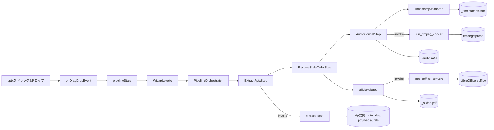

# オンデマンドスライドコンバーター 仕様書 v1
### （Tauri / Bun / TypeScript / Svelte 版）

対象読者：このツールを実装するエンジニア（Claude Code含む）

- **ツール名**：オンデマンドスライドコンバーター
- **リポジトリ名**：`ondemandclass_mspp_converter`
- **ホスト先**：https://github.com/rinfromniigata/ondemandclass_mspp_converter

---

## 0. 目的とスコープ

### 背景
一部のオンデマンド授業（例：「創作に係る倫理と知的財産」）は、講師が
PowerPoint（.pptx）のみをClassroomで配布する形式を取る。この pptx は
スライド切り替えタイミングとナレーション音声がすべて内部に埋め込まれた
自己完結型の教材であり、通常のオンライン授業のように画面録画や動画から
音声を取り出す必要がない。しかし、動画ファイルではないため、そのままでは
文字起こし（Comulytic / Whisper）にも一次資料としてのPDF化にも使えない。

### 目的
pptxファイル1つをアプリにドラッグ＆ドロップするだけで、以下3種の
成果物を**元のpptxと同じディレクトリ**に自動生成する。

1. `<basename>_audio.m4a` … スライド順に結合されたナレーション音声（結合音声）
2. `<basename>_slides.pdf` … スライド内容をそのまま書き出したテキスト層付きPDF（OCR不要）
3. `<basename>_timestamps.json` … 結合音声内での各スライドの開始・終了時刻対応表

この3点は既存の `archive_workflow.md` における工程1（音声取り出し）・
工程3（スライド取得）の出力形式と互換であり、生成後はそのまま工程2
（文字起こし：Comulytic）・工程4（補正：Gemini Gem、timestampsも併せて
投入）に合流できることを前提とする。

### 非スコープ（重要・変更禁止の設計制約）
- **文字起こし・補正・一次情報収集などの後続工程は本ツールの対象外**とする。
  本ツールの責務は3種の成果物を書き出すところまでで完結させる。
- ネットワーク通信は行わない（LibreOffice・ffmpegともにローカル実行のみ）。
  外部APIへのアップロードや自動連携は一切実装しない。
- 監視フォルダ等による自動実行（フォルダにpptxが追加されたら自動変換
  される、等）は実装しない。**常にユーザーのドラッグ＆ドロップ操作を
  トリガーとする。**
- pptx以外の形式（.ppt / .key / Google スライド等）への対応は本仕様の
  対象外とする。将来拡張の余地は残すが、v1では pptx 専用とする。

---

## 1. 技術スタック

| レイヤ | 技術 | 役割 |
|---|---|---|
| デスクトップシェル | Tauri v2 | Rustバックエンド＋Webviewフロントエンドのハイブリッドアプリ |
| パッケージ管理／スクリプト実行 | Bun | `bun install` / `bun run tauri dev` 等 |
| 言語（フロント） | TypeScript | 型安全なUIロジック |
| UIフレームワーク | Svelte（Svelte単体、SvelteKit不要） | 軽量な状態機械的UI記述 |
| pptx（zip）展開 | Rust `zip` crate | ppt/配下のXML・メディアファイルの取り出し |
| XML解析 | Rust `quick-xml` crate | `presentation.xml` / `slideN.xml` / 各`*.rels` の解析 |
| 音声結合 | ffmpeg（外部プロセス起動） | スライド順に並べた音声のconcat結合 |
| 音声長取得 | ffprobe（外部プロセス起動） | 各音声パートの再生時間取得（timestamp計算用） |
| PDF変換 | LibreOffice（`soffice --headless`、外部プロセス起動） | pptxからテキスト層付きPDFへの直接変換 |
| ドラッグ＆ドロップ受付 | Tauri v2 標準の `onDragDropEvent` | OS標準のファイルドロップイベント受信。追加ライブラリ不要 |
| プロセス実行（Rust） | `tauri-plugin-shell` | ffmpeg / ffprobe / soffice の起動 |

対象OSはWindowsを主とする（`archive_workflow.md`のツール群と同一環境）。
LibreOffice・ffmpegはユーザー環境に事前インストール済みであることを
前提とし、パスは設定ファイルで指定可能にする（5章参照）。

---

## 2. 全体アーキテクチャ



- **zip展開・XML解析・外部プロセス（ffmpeg/ffprobe/soffice）起動は
  すべてRust側のTauriコマンドとして実装する**（ファイルI/Oとプロセス
  起動はTauriの権限モデル上もRust側に置くのが自然なため）
- **フロントのSvelte/TypeScriptはOrchestratorとStepの制御フローのみを
  持ち、パース処理そのもののロジックは持たない**（Rust側の責務を
  フロントに漏らさない）
- スライド順序解決（`ResolveSlideOrderStep`）は他の全ステップの前提
  となるため、`AudioConcatStep` と `SlidePdfStep` の両方から参照される
  共有ステップとして独立させる

---

## 3. デザインシステム

本アプリは以下のデザインアセットを同梱する。

- `ondemandclass_mspp_converter_tokens.css` … カラー・タイポグラフィ・余白・角丸・影・モーション・状態レイヤーの値
- `ondemandclass_mspp_converter_icon_master.svg` … アプリアイコンの原本（1024×1024）
- `ondemandclass_mspp_converter_brand.md` … ブランドの方向性（性格・モチーフ・避けたいもの）

コンポーネントはMaterial Design 3（M3）を土台とする。M3のロール名
（primary, on-primary等）をそのまま変数名にはせず、`tokens.css`の
既存のトークン名（`--color-primary`等）をM3の各ロールに対応付けて運用する。

### 原則

**アクセシビリティ**
- 本文とその背景のコントラスト比はWCAG AA基準（4.5:1以上）を満たす
- フォーカス時は`--color-primary-strong`による2px・オフセット2pxの
  フォーカスリングを常時表示する（`:focus-visible`）
- クリック可能領域は最小40×40px。M3標準は48×48px（タッチ操作前提）
  だが、本アプリはマウス操作前提のデスクトップアプリのため40×40pxに
  緩和する
- 状態（成功/失敗/処理中）を色のみで判別させず、アイコン＋テキスト
  ラベルを併記する（色覚多様性への配慮）
- `prefers-reduced-motion: reduce` 環境では、`tokens.css`のモーション系
  カスタムプロパティのdurationを0に短縮する

**レスポンシブの基準幅**
- 単機能ウィザードのため複雑なブレークポイントは設けない
- Tauriウィンドウの最小サイズを480×360pxとし（`tauri.conf.json`の
  `minWidth`/`minHeight`）、それ未満への縮小は許可しない
- 480px以上は常に単一カラムレイアウトとし、複数カラム化は行わない

### コンポーネント方針

M3の elevation（6段階）・shape（7段階）は本アプリの規模に対して
過剰なため、それぞれ3段階・4段階に簡略化する。

| 簡略化後 | 対応するM3概念 | 実装 |
|---|---|---|
| elevation 0 | Level 0 | 影なし |
| elevation 1 | Level 1 | `--shadow-sm` |
| elevation 2 | Level 2-3 | `--shadow-md` |
| elevation 3 | Level 4-5 | `--shadow-lg` |
| shape: sm | Extra-small/Small | `--radius-sm` |
| shape: md | Medium | `--radius-md` |
| shape: lg | Large/Extra-large | `--radius-lg` |
| shape: full | Full | `--radius-full` |

状態レイヤーはM3標準値をそのまま採用する（`tokens.css`に追加済み）。

| 状態 | 不透明度 |
|---|---|
| hover | 8%（`--state-layer-opacity-hover`） |
| focus | 12%（`--state-layer-opacity-focus`） |
| pressed | 12%（`--state-layer-opacity-pressed`） |
| dragged | 16%（`--state-layer-opacity-dragged`） |
| disabled（文字・アイコン） | 38%（`--opacity-disabled-content`） |
| disabled（背景） | 12%（`--opacity-disabled-container`） |

基本部品は以下の7種。すべて enabled/hover/focus/pressed/disabled の
状態を持つ（トグル系はselected/unselectedも持つが、本アプリに
トグル部品はない）。

1. **Button（Filled / Text）**
   - M3対応：Filled Button / Text Button
   - 用途：Filled＝主要操作（「別のファイルを変換する」「出力フォルダを
     開く」「上書きする」）、Text＝補助操作（「キャンセル」「ログ詳細」）
   - 色：背景`--color-primary`、文字`--color-text-on-primary`
   - 形状：shape md（M3既定のpillではなく角丸長方形。理由：方向性Bの
     「軽快」は保ちつつ、玩具的な印象を避けるため）
   - サイズ：高さ40px、横最小64px

2. **Card / Surface container**
   - M3対応：Elevated Card
   - 用途：DropZone全体、ProcessingViewの各ログ行、ResultViewの出力
     ファイル一覧
   - elevation：通常1、ドラッグオーバー時2
   - 形状：shape lg、背景`--color-surface`

3. **List item（ログ行）**
   - M3対応：List item（leading icon付き）
   - 用途：`StepResult`1件＝1行
   - 状態と色：成功＝leadingアイコン`--color-success`、失敗＝
     `--color-error`、処理中＝Progress Indicator（下記）

4. **Progress Indicator**
   - M3対応：Circular Progress Indicator（不定形。処理時間が予測
     できないため）
   - 色：`--color-primary`
   - `ExtractPptxStep`実行中はWizard全体に1つ、`AudioConcatStep`/
     `SlidePdfStep`は並行実行を視覚化するため各ログ行に個別表示する

5. **Dialog**
   - M3対応：Basic Dialog
   - 用途：同名ファイルの上書き確認（9章エッジケース6）
   - elevation：3。スクリムは`--color-text`を6〜8%程度の不透明度で
     オーバーレイ
   - アクション：Filled Button（上書きする）＋Text Button（キャンセル）

6. **Banner（インラインエラー）**
   - M3対応：Banner
   - 用途：ffmpeg/soffice未検出、音声リンク切れなどの非致命的エラー
   - 色：背景は`--color-error`を`--color-surface`と薄く混合、アイコン・
     文字は`--color-error`

7. **Status Chip**
   - M3対応：Assist Chip
   - 用途：ResultView冒頭の「完了」「一部エラー」表示
   - 形状：shape full（本アプリで唯一pill形状を踏襲。ラベル用途のため
     玩具的にならず許容する）

### 確定事項（変更禁止）と委任事項（エージェントに任せる）

**確定事項**
- elevation 3段階・shape 4段階への簡略化方針そのもの
- 上記7種の部品とM3対応・状態・色の役割対応
- クリック可能領域40×40px、フォーカスリング2px、コントラスト比
  4.5:1以上という数値基準

**委任事項**
- 各部品のSvelteコンポーネントとしての実コード化
- 状態レイヤーの具体的なCSS実装（`color-mix()`等の手法選定）
- `:focus-visible`のスタイル実装
- `tauri.conf.json`の`minWidth`/`minHeight`設定

---

## 4. ディレクトリ構成

```
ondemandclass_mspp_converter/
├─ src-tauri/
│  ├─ src/
│  │  ├─ main.rs                    # onDragDropEvent登録、コマンド登録
│  │  └─ commands/
│  │     ├─ mod.rs
│  │     ├─ pptx_extract.rs         # extract_pptx（zip展開＋順序解決＋音声rels解決）
│  │     ├─ audio_process.rs        # run_ffmpeg_concat, probe_duration
│  │     └─ pdf_convert.rs          # run_soffice_convert
│  ├─ capabilities/
│  │  └─ default.json               # 権限定義（7章）
│  └─ tauri.conf.json
├─ src/
│  ├─ lib/
│  │  ├─ steps/
│  │  │  ├─ types.ts                # PipelineState, StepResult, SlideAudioMap
│  │  │  ├─ extractPptxStep.ts
│  │  │  ├─ audioConcatStep.ts
│  │  │  └─ slidePdfStep.ts
│  │  │  └─ timestampJsonStep.ts
│  │  ├─ orchestrator.ts            # PipelineOrchestrator
│  │  ├─ pipelineStore.ts           # writable<PipelineState>
│  │  └─ settings.ts                # ffmpeg/soffice実行パスの読み込み（5.2）
│  ├─ components/
│  │  ├─ DropZone.svelte            # idle画面。pptxのD&D受付
│  │  ├─ Wizard.svelte              # pipelineState.viewで出し分けるだけ
│  │  ├─ ProcessingView.svelte      # 各StepResultを逐次ログ表示
│  │  └─ ResultView.svelte          # 生成物3種へのパス表示・フォルダを開くボタン
│  ├─ App.svelte
│  └─ main.ts
├─ app.settings.json                 # ffmpeg/soffice実行パス等（5.2、要gitignore対象外＝サンプルのみコミット）
├─ app.settings.example.json
├─ package.json
└─ bun.lockb
```

---

## 5. データモデル

### 5.1 TypeScript型定義（`src/lib/steps/types.ts`）

```typescript
export interface SlideAudioEntry {
  slideIndex: number;         // 1始まり、表示順
  slideXmlPath: string;       // 例: "ppt/slides/slide3.xml"
  audioMediaPaths: string[];  // 例: ["ppt/media/audio2.m4a"]（同一スライド内の複数音声は再生順で格納）
  hasAudio: boolean;          // false の場合は無音スライド
}

export interface SlideTimestampEntry {
  slide: number;       // slideIndex
  startSec: number;    // 結合音声内での開始秒
  endSec: number;       // 結合音声内での終了秒
}

export interface StepResult {
  stepName: string;
  success: boolean;
  message: string;
  outputPath?: string;
}

export interface ActionStep<TInput, TOutput> {
  readonly name: string;
  execute(input: TInput): Promise<StepResult & { data?: TOutput }>;
}

// パイプライン全体の状態。Wizard.svelte はこれだけを見て表示を切り替える
export type PipelineState =
  | { view: "idle" }
  | { view: "processing"; pptxPath: string; results: StepResult[] }
  | { view: "done"; pptxPath: string; results: StepResult[]; outputs: { audio: string; pdf: string; json: string } }
  | { view: "error"; pptxPath: string; results: StepResult[]; failedStep: string };
```

### 5.2 `app.settings.json`

```json
{
  "ffmpegPath": "C:\\ffmpeg\\bin\\ffmpeg.exe",
  "ffprobePath": "C:\\ffmpeg\\bin\\ffprobe.exe",
  "sofficePath": "C:\\Program Files\\LibreOffice\\program\\soffice.exe",
  "silentSlideHandling": "insert_silence",
  "audioReencodeOnMismatch": true
}
```

- `silentSlideHandling`：`"insert_silence"`（無音区間を挿入してtimestamp精度を優先）
  または `"skip"`（無音スライドを結合音声から詰めて省略）のいずれか。
  デフォルトは `"insert_silence"`。
- `audioReencodeOnMismatch`：スライド間で音声コーデック／サンプルレートが
  不一致の場合に、`-c copy` 結合を諦めて自動的に再エンコード結合へ
  フォールバックするかどうか（9章参照）。デフォルト `true`。

---

## 6. Rust側（src-tauri）コマンド仕様

### `extract_pptx(pptx_path: String) -> Result<SlideAudioMap, String>`
- 責務：
  1. pptx（zip）を一時ディレクトリに展開する
  2. `ppt/presentation.xml` の `p:sldIdLst` を上から読み、各 `r:id` を
     `ppt/_rels/presentation.xml.rels` で `ppt/slides/slideN.xml` に変換し、
     **表示順のスライドリスト**を確定する
  3. 各 `slideN.xml` について `ppt/slides/_rels/slideN.xml.rels` を参照し、
     Relationship Type に `audio` を含むエントリを抽出する
  4. 同一スライド内に複数の音声パートがある場合、`slideN.xml` 内の
     `p:timing` ノードの再生順（`p:seq`/`p:cond` の並び）に従って
     `audioMediaPaths` を並べる。rels ファイル内の記載順を鵜呑みにしない
  5. 音声が存在しないスライドは `hasAudio: false` として記録する
  6. 音声が **外部リンク参照**（`r:link` で `ppt/media/` 配下に実体がない）
     の場合はエラーとして `StepResult.success = false` にし、
     「リンク切れの可能性があるスライド番号」をメッセージに含める
- 出力：`SlideAudioMap`（`SlideAudioEntry[]` を表示順で保持）＋
  展開先の一時ディレクトリパス
- エラー：zipとして開けない、`presentation.xml` が存在しない、
  スライド順序が解決できない場合に `Err(String)`

### `run_ffmpeg_concat(audio_paths: Vec<String>, silent_durations: Vec<Option<f64>>, out_path: String, reencode: bool) -> Result<Vec<f64>, String>`
- 責務：
  1. `audio_paths` を渡された順（表示順に整列済み）に `concat` 用の
     一覧ファイルを一時生成する
  2. `silent_durations[i]` が `Some(d)` の場合、その位置に
     `ffmpeg -f lavfi -i anullsrc -t d` で生成した無音区間ファイルを
     一覧ファイルへ挿入する（`silentSlideHandling: "insert_silence"` 時のみ呼ばれる）
  3. `reencode = false` なら `-c copy` で結合を試み、失敗した場合
     （コーデック不一致等でffmpegが非ゼロ終了）は `reencode = true` として
     自動的に再結合を試みる
  4. `reencode = true` の場合は `-c:a aac -b:a 192k` で結合する
  5. 結合前に `probe_duration` 相当の処理で各パートの再生時間を取得し、
     結合後の音声内でのスライドごとの開始・終了秒（累積値）を計算して返す
- 出力：各スライドの `[startSec, endSec]` に相当する `Vec<f64>`（フロント側で
  `SlideTimestampEntry[]` に整形する）
- エラー：ffmpeg/ffprobeの実行ファイルが見つからない、結合処理が
  再エンコードでも失敗する場合に `Err(String)`

### `run_soffice_convert(pptx_path: String, out_dir: String) -> Result<String, String>`
- 責務：`soffice --headless --convert-to pdf --outdir <out_dir> <pptx_path>`
  を実行し、生成されたPDFのフルパスを返す
- 備考：LibreOfficeは埋め込み音声を無視して純粋にスライドの視覚内容
  （テキスト・図形・画像）のみをPDF化するため、OCR工程は不要
- エラー：sofficeの実行ファイルが見つからない、変換プロセスが
  非ゼロ終了した場合に `Err(String)`

---

## 7. TypeScript側 モジュール仕様

### `src/lib/steps/extractPptxStep.ts`
- Rustの `extract_pptx` を呼び出すだけの薄いラッパー
- 戻り値の `SlideAudioMap` を後続ステップ（`AudioConcatStep` / `SlidePdfStep`）
  の入力として `PipelineOrchestrator` 経由で受け渡す

### `src/lib/steps/audioConcatStep.ts`
- `SlideAudioMap` から `audio_paths` と `silent_durations` を組み立て、
  `run_ffmpeg_concat` を呼び出す
- 戻り値の各スライド区間秒数を `SlideTimestampEntry[]` に整形し、
  `timestampJsonStep.ts` に渡すためのデータとして保持する
- 出力ファイル名は `<basename>_audio.m4a`（元pptxと同じディレクトリ）

### `src/lib/steps/slidePdfStep.ts`
- `run_soffice_convert` を呼び出すだけ
- `AudioConcatStep` の結果を待たずに**並行実行可能**（互いに依存しない）。
  `PipelineOrchestrator` はこの2ステップを `Promise.all` で並列実行する

### `src/lib/steps/timestampJsonStep.ts`
- `AudioConcatStep` が計算した `SlideTimestampEntry[]` をJSONとして
  `<basename>_timestamps.json` に書き出す
- スキーマ：

```json
[
  { "slide": 1, "startSec": 0.0, "endSec": 42.3 },
  { "slide": 2, "startSec": 42.3, "endSec": 88.1 }
]
```

### `src/lib/orchestrator.ts`
```typescript
export class PipelineOrchestrator {
  async run(pptxPath: string, onProgress: (r: StepResult) => void): Promise<void> {
    const extractResult = await new ExtractPptxStep().execute({ pptxPath });
    onProgress(extractResult);
    if (!extractResult.success) return; // 以降のステップは実行しない（順序解決が前提のため）

    const [audioResult, pdfResult] = await Promise.all([
      new AudioConcatStep().execute({ slideAudioMap: extractResult.data!, pptxPath }),
      new SlidePdfStep().execute({ pptxPath }),
    ]);
    onProgress(audioResult);
    onProgress(pdfResult);

    if (audioResult.success) {
      const jsonResult = await new TimestampJsonStep().execute({
        timestamps: audioResult.data!.timestamps,
        pptxPath,
      });
      onProgress(jsonResult);
    }
  }
}
```
- `ExtractPptxStep` の失敗のみ後続を止める「必須先行ステップ」として扱う。
  それ以外（音声結合とPDF変換）は独立ステップとして、片方が失敗しても
  もう片方の結果は成果物として残す（9章の設計制約）

### `src/lib/pipelineStore.ts`
```typescript
import { writable } from "svelte/store";
import type { PipelineState } from "./steps/types";

export const pipelineState = writable<PipelineState>({ view: "idle" });
```

---

## 8. Svelteコンポーネント仕様

### `DropZone.svelte`
- `$pipelineState.view === "idle"` のときのみ表示
- Tauri v2 標準の `onDragDropEvent` をリッスンし、拡張子が `.pptx` の
  ファイルのみを受け付ける（それ以外はエラー表示のうえ `idle` のまま）
- 受付時：`pipelineState.set({ view: "processing", pptxPath, results: [] })`
  としたのち `PipelineOrchestrator.run()` を呼び出す

### `Wizard.svelte`
- `$pipelineState.view` に応じて `DropZone` / `ProcessingView` / `ResultView`
  を出し分けるだけ（ロジックを持たない）

### `ProcessingView.svelte`
- `results` を逐次ログとして表示（成功=緑、失敗=赤）
- `AudioConcatStep` と `SlidePdfStep` は並行実行されるため、到着順に
  ログへ積む（順序は固定しない）

### `ResultView.svelte`
- 生成された3ファイルのフルパスを表示
- 「出力フォルダを開く」ボタン（元pptxと同じディレクトリを開く）
- 「別のファイルを変換する」ボタンで `{ view: "idle" }` に戻す
- `view === "error"` の場合は、`results` の中から `success: false` の
  ステップのメッセージを強調表示し、原因（例：リンク切れ音声、
  ffmpeg未検出）をそのまま提示する

---

## 9. 設計上の注意点・エッジケース（実装時必読）

これらは前段の検討で洗い出された既知の落とし穴であり、実装時に
必ず考慮すること。

1. **スライド順序はrelsの記載順ではなくpresentation.xmlのsldIdLst順**
   で確定する。`ppt/slides/`配下のファイル名の数字（slide1.xml,
   slide2.xml…）は編集履歴に依存するため表示順と一致しない前提で
   実装する。
2. **1スライド内の複数音声パート**（質疑応答的に区切って録音された
   ケース等）は `slideN.xml` 内の `p:timing` の再生順で結合順を
   決定する。rels側の並びを信用しない。
3. **音声コーデック／サンプルレートの不一致**：`-c copy` 結合が
   ffmpeg側で失敗した場合、自動的に再エンコード結合
   （`-c:a aac -b:a 192k`）にフォールバックする（`app.settings.json`の
   `audioReencodeOnMismatch`で制御）。
4. **無音スライドの扱い**：`silentSlideHandling` 設定に従い、
   「無音区間を挿入してtimestamp精度を保つ」か「詰めて省略する」かを
   ユーザー設定で切り替え可能にする。デフォルトは前者。
5. **音声が外部リンク参照の場合**（埋め込みでなく `r:link`）：
   `ppt/media/` に実体がないため、そのスライドの音声処理を
   スキップしたうえで `StepResult` にリンク切れの旨と該当スライド番号を
   明記する。パイプライン全体は停止させない。
6. **同名ファイルの上書き確認**：出力先に同名の
   `<basename>_audio.m4a` 等が既に存在する場合、無条件上書きせず
   `ResultView` 表示前に確認ダイアログを挟む（誤操作による過去成果物の
   消失を防ぐため）。

---

## 10. 非機能要件

- 一時展開ディレクトリ（zip展開先）は処理完了後（成功・失敗いずれの
  場合も）に必ず削除する。異常終了時のゴミ残りを防ぐため、Rust側で
  `Drop` またはtry/finally相当の後始末処理を実装すること。
- LibreOffice（soffice）は初回起動が遅い（プロファイル初期化）ため、
  変換処理には十分なタイムアウト（例：120秒）を設ける。
- ffmpeg/soffice の実行ファイルが `app.settings.json` のパスに
  存在しない場合、処理開始前にバリデーションし、分かりやすいエラー
  メッセージ（「設定ファイルのffmpegPathを確認してください」等）を
  `idle` 画面の時点で表示する。

---

## 11. SOLID原則の適用方針

| 原則 | 適用箇所 |
|---|---|
| 単一責任 (SRP) | 各Stepクラスは1つの変換処理しか担当しない。`ExtractPptxStep`はパース、`AudioConcatStep`は結合、`SlidePdfStep`は変換、`TimestampJsonStep`は書き出しのみ。Rust側もコマンドごとに責務を分離（`pptx_extract.rs` / `audio_process.rs` / `pdf_convert.rs`） |
| 開放閉鎖 (OCP) | 無音スライドの扱い（挿入/省略）やコーデック不一致時の挙動は `app.settings.json` の設定値で切り替わり、Stepクラス自体のコード変更を要しない |
| リスコフの置換 (LSP) | すべてのStepは `ActionStep<TInput, TOutput>` の契約（例外を投げず必ず `StepResult` を返す）を守る |
| インターフェース分離 (ISP) | `ActionStep` は `name` と `execute` のみの最小インターフェース |
| 依存性逆転 (DIP) | `Wizard.svelte` は `pipelineState` という抽象状態にのみ依存する。`PipelineOrchestrator` は `ActionStep` の実装詳細（zip展開かffmpeg呼び出しか）を意識せず、共通インターフェースにのみ依存する |

---

## 12. 開発・ビルド手順

```bash
# 初回セットアップ
bun create tauri-app ondemandclass_mspp_converter --template svelte-ts
cd ondemandclass_mspp_converter
bun install
cargo add zip quick-xml tauri-plugin-shell --manifest-path src-tauri/Cargo.toml

# 開発起動（事前にffmpeg・LibreOfficeがローカルにインストール済みであること）
bun run tauri dev

# ビルド
bun run tauri build
```

---

## 13. 受け入れ基準（Acceptance Criteria）

- [ ] アプリ起動直後はドロップゾーンのみが表示される（idle画面）
- [ ] pptxファイルをドロップすると自動的に処理が開始し、
      `ExtractPptxStep` → （`AudioConcatStep` と `SlidePdfStep` を並行実行）
      → `TimestampJsonStep` の順でログが表示される
- [ ] 生成される3ファイルが元pptxと同じディレクトリに
      `<basename>_audio.m4a` / `<basename>_slides.pdf` /
      `<basename>_timestamps.json` として書き出される
- [ ] スライド順序が `presentation.xml` の `sldIdLst` に基づいて
      正しく解決され、`ppt/slides/slideN.xml` のファイル名の数字順とは
      無関係に表示順が確定していることをテストで確認できる
- [ ] 1スライド内に複数音声パートがある場合、`p:timing` の再生順で
      結合されることをテストで確認できる
- [ ] 音声コーデックが不一致のサンプルpptxに対して、`-c copy` 結合が
      失敗した場合に自動で再エンコード結合へフォールバックする
- [ ] 無音スライドが含まれる場合、`silentSlideHandling` 設定に応じて
      無音区間挿入／詰めて省略のいずれかが選択どおりに行われる
- [ ] 音声が外部リンク参照でリンク切れのスライドがあっても、
      パイプライン全体は停止せず、該当スライド番号を含むエラー
      メッセージとともに他の成果物は正常に生成される
- [ ] 出力先に同名ファイルが既に存在する場合、上書き前に
      確認ダイアログが表示される
- [ ] ffmpeg・soffice が `app.settings.json` の指定パスに存在しない
      場合、処理開始前にidle画面でエラーが表示され、処理は開始されない
- [ ] 処理完了後、一時展開ディレクトリが残存していない
      （成功時・失敗時いずれのケースもファイルシステムで確認）
- [ ] フォルダ監視やスケジューラによる自動実行機能が存在しない
      （ドラッグ＆ドロップ以外のトリガーが実装されていないことを
      コードレビューで確認）

---

## 14. 将来拡張ポイント

- `.ppt`（旧形式）や Keynote（`.key`）への対応：`extract_pptx` 相当の
  パーサーをフォーマットごとに追加し、`ActionStep` のインターフェースは
  変更しない
- 複数pptxの一括ドロップ（バッチ処理）：`PipelineOrchestrator` を
  ファイルごとに複数生成しキューイングするだけで対応可能な設計に
  しておく（v1ではスコープ外、UIは1ファイルずつの処理を前提とする）
- `archive_workflow.md` の工程7（保存）との連携：生成した3ファイルを
  `/Archive/科目名/日付_回次_タイトル/` 構造へ自動配置するオプションを
  将来追加できるよう、出力パス決定ロジックは `ResultView.svelte` から
  分離した専用モジュール（未実装、v1では元pptxと同ディレクトリ固定）
  に切り出しておくことが望ましい

---

## 15. 注意事項・引き継ぎ事項

- `app.settings.json` にはローカル環境固有の実行ファイルパスが
  含まれるため、リポジトリでは `.gitignore` に追加し、
  `app.settings.example.json`（ダミー値）のみをコミットする
- 本ツールは配布されたpptx単体からの成果物生成に特化しており、
  0章の非スコープに反する機能（自動監視・外部アップロード等）を
  後から追加しないこと
- LibreOfficeのバージョンによって `--convert-to pdf` のレンダリング
  結果（フォント埋め込み・図形の表示崩れ）が変わることがあるため、
  実際に配布されるpptxのフォント・図形要素を用いた動作確認を
  実装後に必ず行うこと
