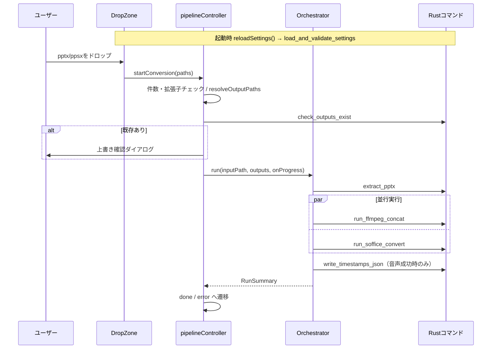

# 実装設計（imple）: 初期アーキテクチャ

- 対象スペック: `roadmap/specs/ondemandclass_mspp_converter_SPEC_v1.md`
- 対応tasks: `roadmap/planning_dialog/260930203323_tasks_initial_implementation.md`
- 対応walk: `roadmap/planning_dialog/260930203357_walk_initial_implementation.md`

本書はスペックシートの5〜7章を実装単位に分解し、モジュールの責務・インターフェース・
内部処理の方針を定める。スペックと食い違う場合はスペックを正とし、本書を修正する。

---

## 1. 設計方針

1. **Rustは「コマンド層」と「ドメイン層」に分ける**
   - コマンド層（`commands/`）：引数の受け取り、`State` からの設定取得、`spawn_blocking`、
     エラーの `String` 化だけを行う
   - ドメイン層（`pptx/` `audio/` `pdf/` `settings/` `process.rs`）：Tauriに依存しない。
     純粋ロジック（XML解析・結合方式判定・タイムライン計算）は外部プロセスからも切り離し、
     単体テストの対象にする
2. **TypeScriptは制御フローのみ**
   - Rust呼び出しは `tauriCommands.ts` に集約し、Step・Orchestrator・Controllerはそれ経由でのみ呼ぶ
   - Orchestratorは注入されたStepのインターフェースにだけ依存する（テストでモック化する）
   - 純粋関数（`resolveOutputPaths` / `buildSegments`）は副作用を持たせずテスト対象にする
3. **仕様変更の影響を局所化する**
   - 出力先決定 → `outputPaths.ts` のみ
   - 無音スライドの扱い → `buildSegments` のみ
   - 結合方式の判定 → `audio/plan.rs` のみ
   - タイムスタンプ計算 → `audio/timeline.rs` のみ

---

## 2. 全体の処理シーケンス



---

## 3. Rust側の構成

### 3.1 モジュール一覧

```
src-tauri/src/
├─ main.rs                 # ondemandclass_mspp_converter_lib::run()
├─ lib.rs                  # Builder: plugin(dialog, opener), manage(AppState), invoke_handler
├─ state.rs                # AppState { settings: Mutex<Option<AppSettings>> }
├─ error.rs                # AppError（thiserror不使用。Display実装で日本語文言を作る）
├─ process.rs              # run_with_timeout
├─ commands/
│  ├─ mod.rs
│  ├─ settings.rs          # load_and_validate_settings
│  ├─ pptx_extract.rs      # extract_pptx
│  ├─ audio_process.rs     # run_ffmpeg_concat
│  ├─ pdf_convert.rs       # run_soffice_convert
│  └─ output_files.rs      # check_outputs_exist, write_timestamps_json
├─ settings/
│  ├─ mod.rs               # AppSettings, SettingsStatus, SilentSlideHandling
│  ├─ locate.rs            # 設定ファイルパスの決定（debug/release）
│  └─ validate.rs          # 読み込み・検証（純粋関数＋ファイル存在確認）
├─ pptx/
│  ├─ mod.rs               # extract_slide_audio_map(reader) -> SlideAudioMap
│  ├─ package.rs           # PptxPackage: zipエントリ読み取り、パス正規化、存在確認
│  ├─ rels.rs              # *.rels 解析 → HashMap<rId, Relationship>
│  ├─ presentation.rs      # sldIdLst → 表示順のスライドパス
│  └─ slide.rs             # 図形・p:timing・advTm・動画検出
├─ audio/
│  ├─ mod.rs               # AudioSegment, ConcatResult, SlideTimestampEntry
│  ├─ probe.rs             # ffprobe 実行とJSON解析
│  ├─ plan.rs              # 結合方式判定（純粋関数）
│  ├─ timeline.rs          # タイムスタンプ計算（純粋関数）
│  └─ concat.rs            # 一時dir・メディア取り出し・無音生成・ffmpeg結合
└─ pdf/
   └─ mod.rs               # convert_to_pdf（soffice実行・移動）
```

### 3.2 共通型（serde、`rename_all = "camelCase"`）

```rust
// settings/mod.rs
#[serde(rename_all = "snake_case")]
pub enum SilentSlideHandling { InsertSilence, Skip }

pub struct AppSettings {
    pub ffmpeg_path: PathBuf,
    pub ffprobe_path: PathBuf,
    pub soffice_path: PathBuf,
    #[serde(default = "default_insert_silence")] pub silent_slide_handling: SilentSlideHandling,
    #[serde(default = "default_3")]              pub silent_slide_default_sec: f64,
    #[serde(default = "default_true")]           pub audio_reencode_on_mismatch: bool,
}

pub struct SettingsStatus {
    pub ok: bool,
    pub settings_path: String,
    pub settings: Option<AppSettings>,
    pub errors: Vec<String>,
}

// pptx/mod.rs
pub struct SlideAudioEntry {
    pub slide_index: u32,
    pub slide_xml_path: String,
    pub audio_media_paths: Vec<String>,
    pub has_audio: bool,
    pub link_broken: bool,
    pub advance_sec: Option<f64>,
}
pub struct SlideAudioMap { pub slides: Vec<SlideAudioEntry>, pub warnings: Vec<String> }

// audio/mod.rs
#[serde(tag = "kind", rename_all = "camelCase")]
pub enum AudioSegment {
    Media   { slide_index: u32, media_path: String },
    Silence { slide_index: u32, duration_sec: f64 },
}
pub struct SlideTimestampEntry { pub slide: u32, pub start_sec: f64, pub end_sec: f64 }
pub struct ConcatResult { pub timestamps: Vec<SlideTimestampEntry>, pub reencoded: bool }
```

- `AudioSegment` のフィールドは serde の `tag` 付き列挙＋各バリアントに
  `#[serde(rename_all = "camelCase")]` を付け、TSの判別共用体
  （`{ kind: "media", slideIndex, mediaPath }`）と一致させる

### 3.3 `process.rs`

```rust
pub struct ProcessOutput { pub status: ExitStatus, pub stdout: String, pub stderr: String }
pub fn run_with_timeout(cmd: Command, timeout: Duration) -> Result<ProcessOutput, AppError>;
```
- `stdout`/`stderr` を `Stdio::piped()` にし、それぞれ別スレッドで読み切る
- 本体は `try_wait` を100ms間隔でポーリングし、超過時は `kill()` → `wait()` してタイムアウトエラー
- Windowsでは `CommandExt::creation_flags(0x08000000)`（CREATE_NO_WINDOW）を付ける
- 起動失敗（`NotFound` 等）は「<実行ファイルパス> を起動できません」に変換する
- エラー文言には stderr の末尾（最大20行）を含める

### 3.4 `settings/`

- `locate.rs`
  - `cfg!(debug_assertions)` のとき：`env!("CARGO_MANIFEST_DIR")` の親（リポジトリ直下）
  - それ以外：`std::env::current_exe()` の親
  - いずれも `app.settings.json` を連結して返す
- `validate.rs`
  - `parse_settings(json: &str) -> Result<AppSettings, String>`（純粋関数）
  - `validate(settings: &AppSettings) -> Vec<String>`（ファイル存在確認を含む）
  - `load_and_validate(path) -> SettingsStatus`
- コマンド `load_and_validate_settings` は結果が `ok` なら `AppState.settings` を更新し、
  `ok` でなければ `None` にする
- 他コマンドは `AppState` から設定を取り出し、`None` なら「設定が読み込まれていません」で `Err`

### 3.5 `pptx/`（`extract_pptx` の中身）

#### package.rs
- `PptxPackage::open(path)`：`zip::ZipArchive<File>` を保持
- `read_string(part)` / `read_bytes(part)` / `exists(part)`
- `resolve_target(base_part, target) -> String`：`ppt/slides/slide3.xml` 基準の
  `../media/media1.m4a` を `ppt/media/media1.m4a` に正規化（`..` と `.` を解決、`/` 区切り）
- `rels_path_of(part)`：`ppt/slides/slide3.xml` → `ppt/slides/_rels/slide3.xml.rels`

#### rels.rs
- `parse_rels(xml) -> HashMap<String, Relationship>`
- `Relationship { id, rel_type, target, external: bool }`（`TargetMode="External"` なら true）

#### presentation.rs
- `slide_order(pkg) -> Result<Vec<String>, AppError>`
  - `ppt/presentation.xml` の `p:sldIdLst/p:sldId` を出現順に読み、`r:id` を収集
  - `ppt/_rels/presentation.xml.rels` で解決し、`ppt/slides/slideN.xml` のリストを返す
  - `sldIdLst` がない、または `r:id` が解決できない場合はエラー

#### slide.rs
- `parse_slide(xml) -> SlideParts`（純粋関数。XML文字列のみを入力にする）
  - `media_shapes: Vec<MediaShape>`：図形ツリーの出現順。
    `MediaShape { shape_id, kind: Audio | Video, link_rid }`
    - `p:cNvPr@id` を shape_id、`p:nvPr/a:audioFile@r:link` または `a:videoFile@r:link` を link_rid とする
  - `timing_audio_order: Vec<String>`：`p:timing` 内の `p:audio` 要素ごとに、
    配下の `p:spTgt@spid` を出現順に収集
  - `advance_sec: Option<f64>`：`p:transition@advTm`（ミリ秒）÷1000。
    `mc:AlternateContent` 内にある場合も探索する（`p:transition` が `mc:Choice`/`mc:Fallback`
    の両方にある場合は最初に見つかった値）
- 音声の並び順の決定：
  1. `timing_audio_order` の spid 順に、該当する Audio 図形を並べる（重複は除く）
  2. timing に現れなかった Audio 図形を図形ツリー順で末尾に追加
- 各 Audio 図形の `link_rid` を rels で引き、
  - rels に存在しない / `external` / 解決先が zip に存在しない → リンク切れ
  - それ以外 → `audio_media_paths` に追加
- Video 図形が1つでもあれば動画ナレーション警告
- XML解析は `quick_xml::Reader` のイベント走査で行う。名前空間プレフィックスは
  ローカル名（`local_name()`）で判定し、プレフィックスの違いに影響されないようにする

#### mod.rs
- `extract_slide_audio_map(pkg) -> Result<SlideAudioMap, AppError>`
  - `slide_order` → 各スライドを `parse_slide` → rels解決 → `SlideAudioEntry` を組み立て
  - 警告文言：
    - 「スライド{n}：音声がリンク切れのため無音として扱います」
    - 「スライド{n}：動画ナレーションはv1では対象外のため無音として扱います」

### 3.6 `audio/`

#### probe.rs
- `probe(ffprobe, file) -> Result<AudioInfo, AppError>`
  - `ffprobe -v error -select_streams a:0 -show_entries stream=codec_name,sample_rate,channels:format=duration -of json <file>`
  - `AudioInfo { codec: String, sample_rate: u32, channels: u32, duration_sec: f64 }`
  - JSON解析部分は `parse_probe_json(&str)` として純粋関数に分けテストする

#### plan.rs（純粋関数）
```rust
pub enum ConcatMode { Copy { codec: String, sample_rate: u32, channels: u32 }, Reencode { channels: u32 } }
pub fn decide_mode(infos: &[AudioInfo]) -> ConcatMode;
```
- 全件 `codec == "aac"` かつ sample_rate・channels が一致 → `Copy`
- それ以外 → `Reencode { channels: max(channels) }`（上限2）

#### timeline.rs（純粋関数）
```rust
pub fn build_timeline(slide_indices: &[u32], segment_durations: &[(u32, f64)]) -> Vec<SlideTimestampEntry>;
```
- `segment_durations` は区間順の（slide_index, 秒）
- 累積しながら各スライドの最初の区間開始〜最後の区間終了を記録。
  区間を持たないスライドはその時点の累積値で start=end

#### concat.rs
- 手順：
  1. `TempDir::new()`（関数スコープで保持。return / `?` / panic いずれでもDropで削除）
  2. `media` 区間：`PptxPackage` から `read_bytes` して `part_{i}.<元拡張子>` として書き出し、`probe`
  3. `decide_mode`。`Reencode` かつ `!reencode_on_mismatch` → Err
     「音声の形式がスライド間で異なります。app.settings.json の audioReencodeOnMismatch を true にすると再エンコードで結合できます」
  4. Copy：無音区間を `-f lavfi -i anullsrc=r={sr}:cl={mono|stereo} -t {d} -c:a aac` で `part_{i}.m4a` として生成
  5. `list.txt` を作成（`file 'part_0.m4a'` 形式。パスは一時dir内の相対名を使いエスケープ問題を避ける）
  6. Copy：`ffmpeg -y -v error -f concat -safe 0 -i list.txt -c copy -movflags +faststart <tmp_out.m4a>`
     失敗かつ `reencode_on_mismatch` → Reencode で再試行
  7. Reencode：各区間を `-ar 48000 -ac {ch} -c:a pcm_s16le` で `norm_{i}.wav` に正規化
     （無音は `anullsrc=r=48000:cl=...` から直接生成）、正規化後のファイルを再度 `probe` して
     再生時間を取り直し、`-c:a aac -b:a 192k -movflags +faststart` で結合
  8. 一時dir内の出力を `out_path` へ移動（`fs::rename`、失敗時はコピー＋削除）。
     一時dirに一度書くのは、途中失敗時に既存の出力ファイルを壊さないため
  9. `build_timeline` で `ConcatResult` を作る（Copy時は元パートの duration、無音は指定秒）
- 各ffmpeg/ffprobeプロセスのタイムアウトは300秒

### 3.7 `pdf/`

- `convert_to_pdf(soffice, profile_dir, input, out_path) -> Result<PathBuf, AppError>`
  1. `TempDir::new()`
  2. `soffice -env:UserInstallation=<profile_dirのfile URL> --headless --norestore --convert-to pdf --outdir <tmp> <input>`
     - file URL は `file:///C:/Users/...` 形式（`\` → `/`、空白等はパーセントエンコード）
  3. タイムアウト120秒
  4. `<tmp>/<入力ファイル名のstem>.pdf` の存在を確認し、`out_path` へ移動
- `profile_dir` はコマンド層で `app.path().app_local_data_dir()/lo_profile` を渡す

### 3.8 `commands/output_files.rs`

- `check_outputs_exist(paths)`：`Path::exists()` で絞り込むだけ
- `write_timestamps_json(out_path, entries)`：秒を `(x * 1000.0).round() / 1000.0` で丸め、
  `serde_json::to_string_pretty` で書き出す。一時ファイルに書いてから `rename` する

### 3.9 `lib.rs`

```rust
tauri::Builder::default()
    .plugin(tauri_plugin_dialog::init())
    .plugin(tauri_plugin_opener::init())
    .manage(AppState::default())
    .invoke_handler(tauri::generate_handler![
        commands::settings::load_and_validate_settings,
        commands::pptx_extract::extract_pptx,
        commands::audio_process::run_ffmpeg_concat,
        commands::pdf_convert::run_soffice_convert,
        commands::output_files::check_outputs_exist,
        commands::output_files::write_timestamps_json,
    ])
```

### 3.10 `capabilities/default.json`

- `core:default`
- `dialog:allow-ask`（上書き確認）
- `opener:allow-reveal-item-in-dir`（出力フォルダを開く）
- ドラッグ＆ドロップは `core:default` に含まれるイベント権限で受信する
- 実装時に各プラグインの権限名を公式ドキュメントで確認し、最小権限にする

### 3.11 `tauri.conf.json`

- `identifier`: `com.rinfromniigata.ondemandclass-mspp-converter`
- `productName`: `ondemandclass_mspp_converter`（実行ファイル名に使われるためASCII）
- ウィンドウタイトル: `オンデマンドスライドコンバーター`、初期サイズ 720×520
- `dragDropEnabled`: true（既定値。明示しておく）

---

## 4. TypeScript側の構成

### 4.1 `tauriCommands.ts`

```typescript
export const commands = {
  loadAndValidateSettings: () => invoke<SettingsStatus>("load_and_validate_settings"),
  extractPptx: (inputPath: string) => invoke<SlideAudioMap>("extract_pptx", { inputPath }),
  runFfmpegConcat: (a: { inputPath: string; slideIndices: number[]; segments: AudioSegment[]; outPath: string; reencodeOnMismatch: boolean }) =>
    invoke<ConcatResult>("run_ffmpeg_concat", a),
  runSofficeConvert: (inputPath: string, outPath: string) => invoke<string>("run_soffice_convert", { inputPath, outPath }),
  checkOutputsExist: (paths: string[]) => invoke<string[]>("check_outputs_exist", { paths }),
  writeTimestampsJson: (outPath: string, entries: SlideTimestampEntry[]) => invoke<string>("write_timestamps_json", { outPath, entries }),
};
export type Commands = typeof commands;
```
- Tauri v2 は Rust の snake_case 引数を JS 側 camelCase で渡す規約のため、それに合わせる
- `SettingsStatus` / `AppSettings` / `ConcatResult` の型もここで定義する

### 4.2 Step 実装方針

- 各Stepは `constructor(private readonly cmd: Commands = commands, ...)` とし、テストでモックを注入できるようにする
- `execute` は全体を `try/catch` で包み、例外は `{ success: false, message: String(e) }` に変換
- `stepName` は日本語の表示名（例：「pptx解析」「音声結合」「PDF変換」「タイムスタンプ書き出し」）

### 4.3 `audioConcatStep.ts`

```typescript
export function buildSegments(slides: SlideAudioEntry[], s: Pick<AppSettings, "silentSlideHandling" | "silentSlideDefaultSec">): AudioSegment[];
```
- スペック6章の規則どおり。`execute` は
  1. `slides.some(s => s.hasAudio)` が偽なら失敗（「音声を含むスライドがありません」）
  2. `buildSegments` → `runFfmpegConcat`
  3. `reencoded` なら警告「音声の形式がスライド間で異なるため再エンコードで結合しました」

### 4.4 `outputPaths.ts`

- `\` と `/` の両方を区切りとして扱い、最後の区切りで dir と ファイル名に分ける
- 拡張子 `.pptx` / `.ppsx` を大文字小文字無視で除去して basename とする
- 出力は `dir + 区切り + basename + "_audio.m4a"` 等。区切りは入力で使われていたものを使う
- 補助関数 `isSupportedInput(path): boolean` もここに置く

### 4.5 `orchestrator.ts`

- スペック6章のコードどおり。`RunSummary` 集計規則：
  - extract 失敗 → `failedSteps = [extract]`、outputs 空
  - audio 成功 → `outputs.audio`、失敗 → failedSteps に追加し JSON は実行しない。
    このとき JSON ステップは「音声結合が失敗したため実行しませんでした」の失敗結果を
    `onProgress` に通知し、failedSteps に追加する
  - pdf 成功 → `outputs.pdf`、失敗 → failedSteps に追加
  - json 成功 → `outputs.json`、失敗 → failedSteps に追加

### 4.6 `pipelineController.ts`

```typescript
export function createPipelineController(deps: {
  store: Writable<PipelineState>;
  getSettings: () => SettingsStatus | null;
  commands: Commands;
  confirm: (message: string) => Promise<boolean>;   // 既定は plugin-dialog の ask
  createOrchestrator: (settings: AppSettings) => PipelineOrchestrator;
}): { startConversion(paths: string[]): Promise<void> };
```
- 依存を注入できるファクトリにして単体テストする。既定のインスタンスを `pipelineController` として export
- 同時実行防止：`get(store).view !== "idle"` なら即 return
- 状態遷移：スペック6章の手順1〜5

### 4.7 `settings.ts`

- `settingsStatus = writable<SettingsStatus | null>(null)`
- `reloadSettings()`：`commands.loadAndValidateSettings()` を呼んでストアに入れる。
  invoke自体が失敗した場合は `{ ok: false, errors: [String(e)], ... }` を入れる

### 4.8 コンポーネント

- `+page.svelte`：`onMount(reloadSettings)`、`<Wizard />` のみ
- `Wizard.svelte`：`{#if $pipelineState.view === "idle"}<DropZone/>{:else if ...}` のみ
- `DropZone.svelte`：
  - `onMount` で `getCurrentWebview().onDragDropEvent(handler)` を登録し、返り値の unlisten を `onDestroy` で呼ぶ
  - `enter`/`over` で強調表示、`leave` で解除、`drop` で `pipelineController.startConversion(event.payload.paths)`
  - 設定エラー時はエラー一覧・設定ファイルパス・「設定を再読み込み」ボタンを表示
- `ProcessingView.svelte`：`results` をリスト表示。スピナーと「処理中…」
- `ResultView.svelte`：成果物パス、警告一覧、失敗ステップ強調、
  「出力フォルダを開く」（`revealItemInDir(最初に存在する成果物)`）、「別のファイルを変換する」
- スタイルは各コンポーネントの `<style>` に最小限で書く（UIライブラリは導入しない）

### 4.9 テスト（Vitest）

- `vite.config.ts` に `test: { environment: "node", include: ["src/**/*.test.ts"] }`
- `package.json` に `"test": "vitest run"`
- 対象：`outputPaths.test.ts`、`audioConcatStep.test.ts`（`buildSegments` と音声なし判定）、
  `orchestrator.test.ts`（モックStep）、`pipelineController.test.ts`（モック依存）

---

## 5. Rust側のテスト方針

- ドメイン層の純粋関数は各モジュール内の `#[cfg(test)] mod tests` で単体テストする
- pptx解析のテスト入力は `src-tauri/tests/common/fixture.rs` の
  `PptxBuilder` でメモリ上に最小構成のzipを組み立てて生成する
  （`presentation.xml`・`presentation.xml.rels`・`slideN.xml`・`slideN.xml.rels`・`ppt/media/*`）。
  LibreOfficeで開ける必要はない（解析のみを検証するため）
- 主なケース：
  - sldIdLst順とファイル名の数字順が異なる
  - 1スライドに音声2つ、relsの記載順と p:timing の順が逆
  - p:timing から参照されない音声図形
  - `TargetMode="External"` の音声、zip内に実体がない音声
  - advTm あり／なし、`mc:AlternateContent` 内の p:transition
  - 動画図形
  - 音声なしスライド
  - ppsx（`[Content_Types].xml` のみ異なる）でも同結果
- ffmpegを使う結合テストは `tests/concat_integration.rs` に置き、`#[ignore]` を付ける。
  環境変数 `FFMPEG_PATH` / `FFPROBE_PATH` を読み、ffmpegで生成した音声
  （44.1kHz/48kHz、mono/stereo、AAC/MP3）をfixtureに埋め込んで実行する。
  実行は `cargo test -- --ignored`

---

## 6. リポジトリへのscaffold導入手順

リポジトリ直下には既に `roadmap/` と `.gitignore` があるため、`create-tauri-app` を直接実行せず以下で行う。

1. スクラッチディレクトリで `bun create tauri-app ondemandclass_mspp_converter --template svelte-ts --manager bun --identifier com.rinfromniigata.ondemandclass-mspp-converter -y` を実行
2. 生成物（`.git` を除く）をリポジトリ直下へコピー。`.gitignore` は既存内容に生成物の内容を追記してマージ
3. `svelte.config.js` が adapter-static・`fallback: "index.html"`、`src/routes/+layout.ts` が `ssr = false` になっていることを確認（テンプレートの既定と異なれば修正）
4. テンプレートのサンプル（greetコマンド、ロゴ画像、サンプルCSS）を削除

---

## 7. `.gitignore` に追加する項目

- `roadmap/archived/`（既存）
- `app.settings.json`
- `samples/`
- scaffoldが生成する項目（`node_modules/`、`.svelte-kit/`、`build/`、`src-tauri/target/` 等）
