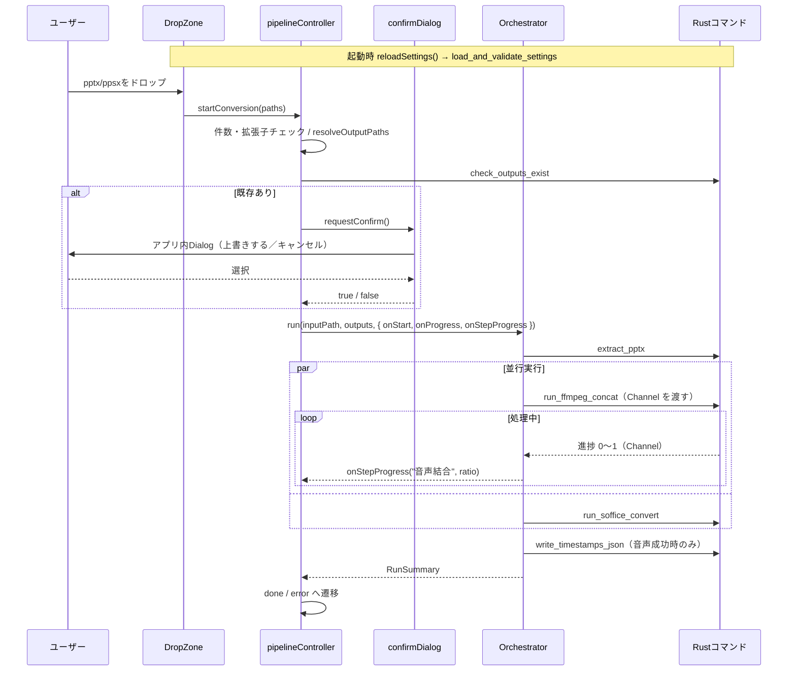

# 実装設計（imple）: 初期アーキテクチャ＋デザインシステム＋音声結合の進捗表示＋PDFの再生アイコン除去＋リリース

- 対象スペック: `roadmap/specs/ondemandclass_mspp_converter_SPEC_v4.md`
- 対応tasks: `roadmap/planning_dialog/261004085952_tasks_pdf_audio_icon_removal.md`
- 対応walk: `roadmap/planning_dialog/261004085953_walk_pdf_audio_icon_removal.md`
- 前版: `roadmap/archived/261003120124_imple_audio_progress.md`
- 変更理由: `roadmap/development/261003173032_change_pdf_audio_icon_removal.md`（前回: `261003115642_change_audio_progress.md`）
- 前版からの変更: PDF変換の前に音声の図形を除去する処理を追加（1章・3.1・3.7・3.7.0・6.1）。v3で変えた箇所は 2章・3.1・3.3・3.6・3.7.1・4.1・4.3・4.5・4.6・5.3・5.4・6.1・6.2

本書はスペックシートの3章・6〜8章を実装単位に分解し、モジュールの責務・インターフェース・
内部処理の方針を定める。スペックと食い違う場合はスペックを正とし、本書を修正する。

---

## 1. 設計方針

1. **Rustは「コマンド層」と「ドメイン層」に分ける**
   - コマンド層（`commands/`）：引数の受け取り、`State` からの設定取得、`spawn_blocking`、
     エラーの `String` 化だけを行う
   - ドメイン層（`pptx/` `audio/` `pdf/` `settings/` `process.rs`）：Tauriに依存しない。
     純粋ロジック（XML解析・結合方式判定・タイムライン計算）は外部プロセスからも切り離し、
     単体テストの対象にする
2. **TypeScriptは制御フローのみ**
   - Rust呼び出しは `tauriCommands.ts` に集約し、Step・Orchestrator・Controllerはそれ経由でのみ呼ぶ
   - Orchestrator・Controllerは注入された依存（Step・確認処理）のインターフェースにだけ依存する（テストでモック化する）
   - 純粋関数（`resolveOutputPaths` / `buildSegments`）は副作用を持たせずテスト対象にする
3. **UIは「基本部品」と「画面」に分ける**
   - 基本部品（`components/ui/`）：見た目と状態（hover/focus/pressed/disabled）だけを持ち、アプリの状態を知らない
   - 画面（`DropZone` 等）：ストアを読み、基本部品を組み合わせるだけ。色・影・角丸の値を直接書かない
4. **仕様変更の影響を局所化する**
   - 出力先決定 → `outputPaths.ts` のみ
   - 無音スライドの扱い → `buildSegments` のみ
   - 結合方式の判定 → `audio/plan.rs` のみ
   - タイムスタンプ計算 → `audio/timeline.rs` のみ
   - 音声結合の進捗の配分・通知間引き → `audio/progress.rs` のみ
   - PDFから除く図形の判定 → `pdf/strip_audio.rs` のみ（v4）
   - 見た目の値 → `tokens.css`（変更禁止）と `base.css`・各基本部品のみ

---

## 2. 全体の処理シーケンス



---

## 3. Rust側の構成

### 3.1 モジュール一覧

```
src-tauri/src/
├─ main.rs                 # ondemandclass_mspp_converter_lib::run()
├─ lib.rs                  # Builder: plugin(opener), manage(AppState), invoke_handler
├─ state.rs                # AppState { settings: Mutex<Option<AppSettings>> }
├─ error.rs                # AppError（Display実装で日本語文言を作る）
├─ process.rs              # run_with_timeout, run_with_timeout_streaming
├─ commands/
│  ├─ mod.rs
│  ├─ settings.rs          # load_and_validate_settings
│  ├─ pptx_extract.rs      # extract_pptx
│  ├─ audio_process.rs     # run_ffmpeg_concat
│  ├─ pdf_convert.rs       # run_soffice_convert
│  └─ output_files.rs      # check_outputs_exist, write_timestamps_json
├─ settings/
│  ├─ mod.rs               # AppSettings, SettingsStatus, SilentSlideHandling
│  ├─ locate.rs            # 設定ファイルパスの決定（debug/release）
│  └─ validate.rs          # 読み込み・検証（純粋関数＋ファイル存在確認）
├─ pptx/
│  ├─ mod.rs               # extract_slide_audio_map(pkg) -> SlideAudioMap
│  ├─ package.rs           # PptxPackage: zipエントリ読み取り、パス正規化、存在確認
│  ├─ rels.rs              # *.rels 解析 → HashMap<rId, Relationship>
│  ├─ presentation.rs      # sldIdLst → 表示順のスライドパス
│  └─ slide.rs             # 図形・p:timing・advTm・動画検出
├─ audio/
│  ├─ mod.rs               # AudioSegment, ConcatResult, SlideTimestampEntry
│  ├─ probe.rs             # ffprobe 実行とJSON解析
│  ├─ plan.rs              # 結合方式判定（純粋関数）
│  ├─ timeline.rs          # タイムスタンプ計算（純粋関数）
│  ├─ progress.rs          # 進捗の配分・単調化・間引き、-progress 出力の解釈（純粋ロジック）
│  └─ concat.rs            # 一時dir・メディア取り出し・無音生成・ffmpeg結合
└─ pdf/
   ├─ mod.rs               # convert_to_pdf（加工済みコピーの作成・soffice実行・移動）
   └─ strip_audio.rs       # 音声図形の除去（v4。XMLの加工は純粋関数）
```

### 3.2 共通型（serde、`rename_all = "camelCase"`）

```rust
// settings/mod.rs
#[serde(rename_all = "snake_case")]
pub enum SilentSlideHandling { InsertSilence, Skip }

pub struct AppSettings {
    pub ffmpeg_path: PathBuf,
    pub ffprobe_path: PathBuf,
    pub soffice_path: PathBuf,
    #[serde(default = "default_insert_silence")] pub silent_slide_handling: SilentSlideHandling,
    #[serde(default = "default_3")]              pub silent_slide_default_sec: f64,
    #[serde(default = "default_true")]           pub audio_reencode_on_mismatch: bool,
}

pub struct SettingsStatus {
    pub ok: bool,
    pub settings_path: String,
    pub settings: Option<AppSettings>,
    pub errors: Vec<String>,
}

// pptx/mod.rs
pub struct SlideAudioEntry {
    pub slide_index: u32,
    pub slide_xml_path: String,
    pub audio_media_paths: Vec<String>,
    pub has_audio: bool,
    pub link_broken: bool,
    pub advance_sec: Option<f64>,
}
pub struct SlideAudioMap { pub slides: Vec<SlideAudioEntry>, pub warnings: Vec<String> }

// audio/mod.rs
#[serde(tag = "kind", rename_all = "camelCase")]
pub enum AudioSegment {
    Media   { slide_index: u32, media_path: String },
    Silence { slide_index: u32, duration_sec: f64 },
}
pub struct SlideTimestampEntry { pub slide: u32, pub start_sec: f64, pub end_sec: f64 }
pub struct ConcatResult { pub timestamps: Vec<SlideTimestampEntry>, pub reencoded: bool }
```

- `AudioSegment` は serde の `tag` 付き列挙＋各バリアントに
  `#[serde(rename_all = "camelCase")]` を付け、TSの判別共用体
  （`{ kind: "media", slideIndex, mediaPath }`）と一致させる

### 3.3 `process.rs`

```rust
pub struct ProcessOutput { pub status: ExitStatus, pub stdout: String, pub stderr: String }
pub fn run_with_timeout(cmd: Command, timeout: Duration) -> Result<ProcessOutput, AppError>;
```
- `stdout`/`stderr` を `Stdio::piped()` にし、それぞれ別スレッドで読み切る
- 本体は `try_wait` を100ms間隔でポーリングし、超過時は `kill()` → `wait()` してタイムアウトエラー
- Windowsでは `CommandExt::creation_flags(0x08000000)`（CREATE_NO_WINDOW）を付ける
- 起動失敗（`NotFound` 等）は「<実行ファイルパス> を起動できません」に変換する
- エラー文言には stderr の末尾（最大20行）を含める

```rust
pub fn run_with_timeout_streaming(
    cmd: Command,
    timeout: Duration,
    on_stdout_line: &mut dyn FnMut(&str),
) -> Result<ProcessOutput, AppError>;
```
- 進捗表示用（v3）。stdout の読み取りスレッドが1行読むごとに mpsc で本体へ送り、本体はポーリングの合間に
  受け取った行を `on_stdout_line` に渡す（コールバックは呼び出し元のスレッドで実行する。スレッドをまたがせない）
- 受け取った行は従来どおり `ProcessOutput.stdout` にも蓄える
- タイムアウト・kill・子孫プロセスの終了・パイプの読み切り猶予は `run_with_timeout` と共通の実装にする。
  `run_with_timeout` は何もしないコールバックで `run_with_timeout_streaming` を呼ぶ形に置き換え、既存の単体テストをそのまま通す

### 3.4 `settings/`

- `locate.rs`
  - `cfg!(debug_assertions)` のとき：`env!("CARGO_MANIFEST_DIR")` の親（リポジトリ直下）
  - それ以外：`std::env::current_exe()` の親
  - いずれも `app.settings.json` を連結して返す
- `validate.rs`
  - `parse_settings(json: &str) -> Result<AppSettings, String>`（純粋関数）
  - `validate(settings: &AppSettings) -> Vec<String>`（ファイル存在確認を含む）
  - `load_and_validate(path) -> SettingsStatus`
- コマンド `load_and_validate_settings` は結果が `ok` なら `AppState.settings` を更新し、
  `ok` でなければ `None` にする
- 他コマンドは `AppState` から設定を取り出し、`None` なら「設定が読み込まれていません」で `Err`

### 3.5 `pptx/`（`extract_pptx` の中身）

#### package.rs
- `PptxPackage::open(path)`：`zip::ZipArchive<File>` を保持
- `read_string(part)` / `read_bytes(part)` / `exists(part)`
- `resolve_target(base_part, target) -> String`：`ppt/slides/slide3.xml` 基準の
  `../media/media1.m4a` を `ppt/media/media1.m4a` に正規化（`..` と `.` を解決、`/` 区切り）
- `rels_path_of(part)`：`ppt/slides/slide3.xml` → `ppt/slides/_rels/slide3.xml.rels`

#### rels.rs
- `parse_rels(xml) -> HashMap<String, Relationship>`
- `Relationship { id, rel_type, target, external: bool }`（`TargetMode="External"` なら true）

#### presentation.rs
- `slide_order(pkg) -> Result<Vec<String>, AppError>`
  - `ppt/presentation.xml` の `p:sldIdLst/p:sldId` を出現順に読み、`r:id` を収集
  - `ppt/_rels/presentation.xml.rels` で解決し、`ppt/slides/slideN.xml` のリストを返す
  - `sldIdLst` がない、または `r:id` が解決できない場合はエラー

#### slide.rs
- `parse_slide(xml) -> SlideParts`（純粋関数。XML文字列のみを入力にする）
  - `media_shapes: Vec<MediaShape>`：図形ツリーの出現順。
    `MediaShape { shape_id, kind: Audio | Video, link_rid }`
    - `p:cNvPr@id` を shape_id、`p:nvPr/a:audioFile@r:link` または `a:videoFile@r:link` を link_rid とする
  - `timing_audio_order: Vec<String>`：`p:timing` 内の `p:audio` 要素ごとに、
    配下の `p:spTgt@spid` を出現順に収集
  - `advance_sec: Option<f64>`：`p:transition@advTm`（ミリ秒）÷1000。
    `mc:AlternateContent` 内にある場合も探索する（`mc:Choice`/`mc:Fallback`
    の両方にある場合は最初に見つかった値）
- 音声の並び順の決定：
  1. `timing_audio_order` の spid 順に、該当する Audio 図形を並べる（重複は除く）
  2. timing に現れなかった Audio 図形を図形ツリー順で末尾に追加
- 各 Audio 図形の `link_rid` を rels で引き、
  - rels に存在しない / `external` / 解決先が zip に存在しない → リンク切れ
  - それ以外 → `audio_media_paths` に追加
- Video 図形が1つでもあれば動画ナレーション警告
- XML解析は `quick_xml::Reader` のイベント走査で行う。名前空間プレフィックスは
  ローカル名（`local_name()`）で判定し、プレフィックスの違いに影響されないようにする

#### mod.rs
- `extract_slide_audio_map(pkg) -> Result<SlideAudioMap, AppError>`
  - `slide_order` → 各スライドを `parse_slide` → rels解決 → `SlideAudioEntry` を組み立て
  - 警告文言：
    - 「スライド{n}：音声がリンク切れのため無音として扱います」
    - 「スライド{n}：動画ナレーションは対象外のため無音として扱います」

### 3.6 `audio/`

#### probe.rs
- `probe(ffprobe, file) -> Result<AudioInfo, AppError>`
  - `ffprobe -v error -select_streams a:0 -show_entries stream=codec_name,sample_rate,channels:format=duration -of json <file>`
  - `AudioInfo { codec: String, sample_rate: u32, channels: u32, duration_sec: f64 }`
  - JSON解析部分は `parse_probe_json(&str)` として純粋関数に分けテストする

#### plan.rs（純粋関数）
```rust
pub enum ConcatMode { Copy { codec: String, sample_rate: u32, channels: u32 }, Reencode { channels: u32 } }
pub fn decide_mode(infos: &[AudioInfo]) -> ConcatMode;
```
- 全件 `codec == "aac"` かつ sample_rate・channels が一致 → `Copy`
- それ以外 → `Reencode { channels: max(channels) }`（上限2）

#### timeline.rs（純粋関数）
```rust
pub fn build_timeline(slide_indices: &[u32], segment_durations: &[(u32, f64)]) -> Vec<SlideTimestampEntry>;
```
- `segment_durations` は区間順の（slide_index, 秒）
- 累積しながら各スライドの最初の区間開始〜最後の区間終了を記録。
  区間を持たないスライドはその時点の累積値で start=end

#### progress.rs（v3。Tauri・外部プロセスに依存しない）
```rust
/// 0〜1 の割合を受け取る通知先。コマンド層で Channel への送信に変換する
pub type ProgressSink<'a> = &'a mut dyn FnMut(f64);

/// 単調化と間引きを行う通知器
pub struct ProgressReporter<'a> { sink: ProgressSink<'a>, sent: f64 }
impl ProgressReporter<'_> {
    pub fn new(sink: ProgressSink<'_>) -> ProgressReporter<'_>;
    /// ratio を 0〜1 に丸め、送信済みの値以下なら無視、送信済み +0.01 未満なら送らない（1.0 は必ず送る）
    pub fn report(&mut self, ratio: f64);
    pub fn current(&self) -> f64; // 送信済みの値（再試行時の起点に使う）
}

/// 全体 [start, end] の中の1段階分の範囲
#[derive(Clone, Copy)]
pub struct Span { pub start: f64, pub end: f64 }
impl Span {
    /// 範囲内の割合 t（0〜1）を全体の割合に変換する
    pub fn at(self, t: f64) -> f64;
    /// 範囲を weights の比で分割する
    pub fn split<const N: usize>(self, weights: [f64; N]) -> [Span; N];
}

/// `-progress` の1行から出力済みの秒数を取り出す（`out_time_us=123456` → Some(0.123456)。`N/A` 等は None）
pub fn parse_out_time_sec(line: &str) -> Option<f64>;
```
- 段階と配分の初期値（T7-8 で実サンプルの所要時間を測って見直し、定数として `progress.rs` に置く）
  - copy 方式: 取り出し（音声区間の書き出し＋ffprobe）`0.2`／区間生成（無音区間の生成）`0.1`／結合 `0.7`
  - 再エンコード方式: 取り出し `0.1`／区間生成（各区間のWAV正規化＋ffprobe）`0.5`／結合 `0.4`
  - 結合方式は取り出しの後に決まるため、取り出しは両方式で共通の配分（`0.2` とし、再エンコード時は残りを比で配る）にしてよい。最終値は T7-8 の実施メモに残す
- 段階内の進め方
  - 取り出し・区間生成: 対象の区間を1つ終えるごとに `完了数 ÷ 対象数` で進める（対象が0件なら段階の終わりまで進める）
  - 結合: `run_with_timeout_streaming` で ffmpeg に `-progress pipe:1 -nostats` を付け、`out_time_us ÷ 総尺`（取り出し・区間生成で求めた各区間の長さの合計）で進める
- copy 結合が失敗して再エンコードで再試行する場合: その時点の `reporter.current()` から 1 までを新しい全体範囲として、再エンコード方式の「区間生成・結合」の比で分け直す（割合を戻さない）
- 正常終了で出力を `out_path` へ移した後に `report(1.0)` を呼ぶ。エラー時は 1 を送らない

#### concat.rs
- 手順：
  1. `TempDir::new()`（関数スコープで保持。return / `?` / panic いずれでもDropで削除）
  2. `media` 区間：`PptxPackage` から `read_bytes` して `part_{i}.<元拡張子>` として書き出し、`probe`
  3. `decide_mode`。`Reencode` かつ `!reencode_on_mismatch` → Err
     「音声の形式がスライド間で異なります。app.settings.json の audioReencodeOnMismatch を true にすると再エンコードで結合できます」
  4. Copy：無音区間を `-f lavfi -i anullsrc=r={sr}:cl={mono|stereo} -t {d} -c:a aac` で `part_{i}.m4a` として生成
  5. `list.txt` を作成（`file 'part_0.m4a'` 形式。パスは一時dir内の相対名を使いエスケープ問題を避ける）
  6. Copy：`ffmpeg -y -v error -f concat -safe 0 -i list.txt -c copy -movflags +faststart <tmp_out.m4a>`
     失敗かつ `reencode_on_mismatch` → Reencode で再試行
  7. Reencode：各区間を `-ar 48000 -ac {ch} -c:a pcm_s16le` で `norm_{i}.wav` に正規化
     （無音は `anullsrc=r=48000:cl=...` から直接生成）、正規化後のファイルを再度 `probe` して
     再生時間を取り直し、`-c:a aac -b:a 192k -movflags +faststart` で結合
  8. 一時dir内の出力を `out_path` へ移動（`fs::rename`、失敗時はコピー＋削除）。
     一時dirに一度書くのは、途中失敗時に既存の出力ファイルを壊さないため
  9. `build_timeline` で `ConcatResult` を作る（Copy時は元パートの duration、無音は指定秒）
- 各ffmpeg/ffprobeプロセスのタイムアウトは300秒
- 進捗（v3）: `concat_audio` の最後の引数に `on_progress: ProgressSink<'_>` を追加し、関数内で `ProgressReporter` を作る。
  手順2（取り出し）・4/7（区間生成）・6/7の最終結合（結合）で、`progress.rs` の配分どおりに `report` する。
  最終結合だけ `run_with_timeout_streaming` を使い、それ以外の ffmpeg/ffprobe の呼び出しは従来どおり `run_with_timeout`
- 既存の呼び出し（結合テスト等）は、何もしないコールバック `&mut |_| {}` を渡して動作を変えない

### 3.7 `pdf/`

- `convert_to_pdf(soffice, profile_dir, input, out_path) -> Result<PathBuf, AppError>`（シグネチャはv3から変えない）
  1. `TempDir::new()`
  2. （v4）`<tmp>/src/<入力のファイル名>` に `write_pdf_source(input, そのパス)` で音声図形を除去したコピーを作る
     - ファイル名を入力と同じにするのは、soffice の出力名 `<stem>.pdf` と、拡張子によるpptx/ppsxの判別を変えないため
     - 出力先（`<tmp>`）とは別のサブフォルダに置く
  3. `soffice -env:UserInstallation=<profile_dirのfile URL> --headless --norestore --convert-to pdf --outdir <tmp> <加工済みコピー>`
     - file URL は `file:///C:/Users/...` 形式（`\` → `/`、空白等はパーセントエンコード）
  4. タイムアウト120秒
  5. `<tmp>/<入力ファイル名のstem>.pdf` の存在を確認し、`out_path` へ移動
- `profile_dir` はコマンド層で `app.path().app_local_data_dir()/lo_profile` を渡す
- コマンド層（`commands/pdf_convert.rs`）・TypeScript・画面は変更しない

#### 3.7.0 `pdf/strip_audio.rs`（v4）

- `pub fn strip_audio_shapes(xml: &str) -> Result<Option<String>, AppError>`（純粋関数）
  - スライドXMLから、音声の図形（`p:pic` のうち `nvPicPr` 直下の `nvPr` 直下に `audioFile` を持つもの）を取り除いた文字列を返す。該当がなければ `None`（呼び出し側は元のバイト列をそのままコピーする）
  - quick-xml で読み、`pic` の開始タグの直前から終了タグの直後までのバイト範囲（`Reader::buffer_position`）を記録する。`pic` 内で上記の親子関係の `audioFile` を見たら、その範囲を削除対象にする。範囲を後ろから順に切り取る
  - 要素はローカル名で判定し、親要素を確認する（`pptx/slide.rs` と同じ方針。それ以外の場所にある同名要素は対象にしない）
  - `mc:AlternateContent` の中の `p:pic` も、分岐ごとにそれぞれ判定して除去する（どちらの分岐が使われてもPDFに出さないため）
  - 動画の図形（`videoFile`）は対象にしない
  - `p:timing` 内の `p:spTgt` は残す（PDFはアニメーションを使わず、LibreOffice が存在しない図形への参照を無視して変換できることを変更時の検証で確認した）
  - XMLとして読めない場合は `AppError::Message`（パート名は呼び出し側で付ける）
- `pub fn write_pdf_source(input: &Path, dest: &Path) -> Result<usize, AppError>`
  - 入力のzipを開き、エントリ順を保って `dest` に新しいzipを書く。戻り値は除去した図形の数（テスト用）
  - 名前が `ppt/slides/slide*.xml`（`ppt/slides/` 直下。`_rels` は除く）のエントリは文字列として読み（先頭のBOMは除く）、`strip_audio_shapes` が `Some` を返したら Deflate で書き直す
  - それ以外のエントリ（`None` を返したスライドを含む）は `ZipWriter::raw_copy_file` で再圧縮せずにコピーする（音声・画像の大きいメディアを速くコピーするため）
  - 入力ファイルは読むだけで変更しない
  - zip・XMLを読めない、書けない場合は、パート名と入力パスを含む `AppError`
  - zip crate の API（`raw_copy_file`・書き込みオプション等）はインストール済みのバージョン（`Cargo.lock`）と docs.rs で確認してから使う

### 3.7.1 `commands/audio_process.rs`（v3）

- `run_ffmpeg_concat` に引数 `on_progress: tauri::ipc::Channel<f64>` を追加する（JS側の引数名は `onProgress`）
- `spawn_blocking` のクロージャへ Channel を move し、`concat_audio` には `&mut |ratio| { let _ = on_progress.send(ratio); }` を渡す。
  送信の失敗（画面側が破棄済み等）は無視し、変換は続ける
- `Channel` の型・送信APIは、インストール済みの tauri 2.12.1 のドキュメントで確認してから使う

### 3.8 `commands/output_files.rs`

- `check_outputs_exist(paths)`：`Path::exists()` で絞り込むだけ
- `write_timestamps_json(out_path, entries)`：秒を `(x * 1000.0).round() / 1000.0` で丸め、
  `serde_json::to_string_pretty` で書き出す。一時ファイルに書いてから `rename` する

### 3.9 `lib.rs`

```rust
tauri::Builder::default()
    .plugin(tauri_plugin_opener::init())
    .manage(AppState::default())
    .invoke_handler(tauri::generate_handler![
        commands::settings::load_and_validate_settings,
        commands::pptx_extract::extract_pptx,
        commands::audio_process::run_ffmpeg_concat,
        commands::pdf_convert::run_soffice_convert,
        commands::output_files::check_outputs_exist,
        commands::output_files::write_timestamps_json,
    ])
```

### 3.10 `capabilities/default.json`

- `core:default`
- `opener:allow-reveal-item-in-dir`（出力フォルダを開く）
- ドラッグ＆ドロップは `core:default` に含まれるイベント権限で受信する
- 実装時に各プラグインの権限名を公式ドキュメントで確認し、最小権限にする

### 3.11 `tauri.conf.json`

- `identifier`: `com.rinfromniigata.ondemandclass-mspp-converter`
- `productName`: `ondemandclass_mspp_converter`（実行ファイル名に使われるためASCII）
- ウィンドウ
  - タイトル: `オンデマンドスライドコンバーター`
  - 初期サイズ 720×520、`minWidth: 480`、`minHeight: 360`
  - `dragDropEnabled`: true（既定値。明示しておく）
- `bundle.icon`: `tauri icon` が生成した `icons/` 配下のファイル群

---

## 4. TypeScript側の構成

### 4.1 `tauriCommands.ts`

```typescript
export const commands = {
  loadAndValidateSettings: () => invoke<SettingsStatus>("load_and_validate_settings"),
  extractPptx: (inputPath: string) => invoke<SlideAudioMap>("extract_pptx", { inputPath }),
  runFfmpegConcat: (a: { inputPath: string; slideIndices: number[]; segments: AudioSegment[]; outPath: string; reencodeOnMismatch: boolean }) =>
    invoke<ConcatResult>("run_ffmpeg_concat", a),
  runSofficeConvert: (inputPath: string, outPath: string) => invoke<string>("run_soffice_convert", { inputPath, outPath }),
  checkOutputsExist: (paths: string[]) => invoke<string[]>("check_outputs_exist", { paths }),
  writeTimestampsJson: (outPath: string, entries: SlideTimestampEntry[]) => invoke<string>("write_timestamps_json", { outPath, entries }),
};
export type Commands = typeof commands;
```
- Tauri v2 は Rust の snake_case 引数を JS 側 camelCase で渡す規約のため、それに合わせる
- 進捗（v3）: `runFfmpegConcat(a, onProgress?: (ratio: number) => void)` とする。関数内で
  `new Channel<number>()`（`@tauri-apps/api/core`）を作り、`onmessage` に `onProgress` をつないで `{ ...a, onProgress: channel }` で invoke する。
  `onProgress` が省略されても Channel は渡す（Rust側の引数は必須のため）
- `SettingsStatus` / `AppSettings` / `ConcatResult` の型もここで定義する

### 4.2 Step 実装方針

- 各Stepは `constructor(private readonly cmd: Commands = commands, ...)` とし、テストでモックを注入できるようにする
- `execute` は全体を `try/catch` で包み、例外は `{ success: false, message: String(e) }` に変換
- `name` と `stepName` は同じ日本語の表示名（「pptx解析」「音声結合」「PDF変換」「タイムスタンプ書き出し」）。
  `running` の照合にも `name` を使う

### 4.3 `audioConcatStep.ts`

```typescript
export function buildSegments(slides: SlideAudioEntry[], s: Pick<AppSettings, "silentSlideHandling" | "silentSlideDefaultSec">): AudioSegment[];
```
- スペック7章の規則どおり。`execute` は
  1. `slides.some(s => s.hasAudio)` が偽なら失敗（「音声を含むスライドがありません」）
  2. `buildSegments` → `runFfmpegConcat`
  3. `reencoded` なら警告「音声の形式がスライド間で異なるため再エンコードで結合しました」
- 進捗（v3）: `AudioConcatInput` に `onProgress?: (ratio: number) => void` を追加し、`runFfmpegConcat` の第2引数へそのまま渡す。
  Step 自身は割合を加工しない（単調化・間引きは Rust 側で済んでいる）

### 4.4 `outputPaths.ts`

- `\` と `/` の両方を区切りとして扱い、最後の区切りで dir と ファイル名に分ける
- 拡張子 `.pptx` / `.ppsx` を大文字小文字無視で除去して basename とする
- 出力は `dir + 区切り + basename + "_audio.m4a"` 等。区切りは入力で使われていたものを使う
- 補助関数 `isSupportedInput(path): boolean` もここに置く

### 4.5 `orchestrator.ts`

- スペック7章のコードどおり。`onStart` は各ステップの `execute` 呼び出し直前に呼ぶ
- `RunSummary` 集計規則：
  - extract 失敗 → `failedSteps = [extract]`、outputs 空
  - audio 成功 → `outputs.audio`、失敗 → failedSteps に追加し JSON は実行しない。
    このとき JSON ステップは `onStart` を呼ばず、「音声結合が失敗したため実行しませんでした」の
    失敗結果を `onProgress` に通知し、failedSteps に追加する
  - pdf 成功 → `outputs.pdf`、失敗 → failedSteps に追加
  - json 成功 → `outputs.json`、失敗 → failedSteps に追加
- 進捗（v3）: `PipelineCallbacks` に `onStepProgress(stepName, ratio)` を追加する。音声結合の `execute` に
  `onProgress: (ratio) => cb.onStepProgress(audio.name, ratio)` を渡す。ほかのステップには渡さない
- `cb.onStart(audio.name)` の直後に `cb.onStepProgress(audio.name, 0)` を呼ぶ（最初の通知が届く前から確定型の 0% を出すため。どのステップを確定型にするかを Orchestrator だけが決める）

### 4.6 `pipelineController.ts`

```typescript
export function createPipelineController(deps: {
  store: Writable<PipelineState>;
  getSettings: () => SettingsStatus | null;
  commands: Commands;
  confirm: (req: ConfirmRequest) => Promise<boolean>;   // 既定は confirmDialog.requestConfirm
  createOrchestrator: (settings: AppSettings) => PipelineOrchestrator;
}): { startConversion(paths: string[]): Promise<void> };
```
- 依存を注入できるファクトリにして単体テストする。既定のインスタンスを `pipelineController` として export
- 同時実行防止：`get(store).view !== "idle"` なら即 return
- `onStart(name)`：`running` に追加。`onProgress(r)`：`running` と `progress` から `r.stepName` を除き、`results` に追加
- `onStepProgress(name, ratio)`（v3）：`view === "processing"` かつ `running` に `name` があるときだけ `progress[name] = ratio` にする
  （完了通知の後に遅れて届いた進捗で行が復活しないようにするため）
- `processing` へ遷移するときは `progress: {}` で初期化する
- 状態遷移：スペック7章の手順1〜5

### 4.7 `confirmDialog.ts`

```typescript
export interface ConfirmRequest { title: string; message: string; details?: string[]; confirmLabel: string; cancelLabel: string }
export const pendingConfirm: Readable<(ConfirmRequest & { resolve: (ok: boolean) => void }) | null>;
export function requestConfirm(req: ConfirmRequest): Promise<boolean>;
```
- 同時に1件だけ保持する。表示中に新しい要求が来た場合は前の要求を `false` で解決してから置き換える
- `ConfirmDialog.svelte` がボタン押下・Esc で `resolve` を呼び、ストアを `null` に戻す

### 4.8 `settings.ts`

- `settingsStatus = writable<SettingsStatus | null>(null)`
- `reloadSettings()`：`commands.loadAndValidateSettings()` を呼んでストアに入れる。
  invoke自体が失敗した場合は `{ ok: false, errors: [String(e)], ... }` を入れる

---

## 5. デザインシステムの実装

### 5.1 スタイルの読み込み

- `src/lib/styles/tokens.css`：`ondemandclass_mspp_converter_tokens.css` を**値を変えずに**配置する
  （ファイル冒頭に原本のパスを示すコメントを1行追加するのみ）
- `src/lib/styles/base.css`：
  - 最小限のリセット（`box-sizing`、`margin: 0`、`body` に `--font-family-base` / `--font-size-base` /
    `--line-height-base` / `--color-bg` / `--color-text`）
  - `color-scheme: light dark`（スクロールバー等のOS部品の配色を追従させる）
  - フォーカスリング：`:focus-visible { outline: 2px solid var(--color-primary-strong); outline-offset: 2px; }`
  - reduced-motion：
    ```css
    @media (prefers-reduced-motion: reduce) {
      :root { --motion-duration-fast: 0ms; --motion-duration-base: 0ms; --motion-duration-slow: 0ms; }
    }
    ```
    （tokens.css より後に読み込むことで上書きする）
  - 部品間で共有するユーティリティ：`.elevation-0〜3`（`box-shadow`）、`.shape-sm/md/lg/full`（`border-radius`）
- `src/routes/+layout.svelte` で `tokens.css` → `base.css` の順に import する

### 5.2 状態レイヤー

- 手法は `::before` 疑似要素＋`color-mix()` を採用する（背景色を書き換えず、どの背景色の部品にも同じ方法で重ねられるため）
  ```css
  .state-layer { position: relative; isolation: isolate; }
  .state-layer::before {
    content: ""; position: absolute; inset: 0; border-radius: inherit; z-index: -1;
    background: currentColor; opacity: 0;
    transition: opacity var(--motion-duration-fast) var(--motion-easing-standard);
  }
  .state-layer:hover::before { opacity: var(--state-layer-opacity-hover); }
  .state-layer:focus-visible::before { opacity: var(--state-layer-opacity-focus); }
  .state-layer:active::before { opacity: var(--state-layer-opacity-pressed); }
  ```
- disabled：文字・アイコンは `opacity: var(--opacity-disabled-content)`、
  Filled Button の背景は `color-mix(in srgb, var(--color-text) calc(var(--opacity-disabled-container) * 100%), transparent)`
- dragged（16%）：DropZone のドラッグオーバー時に Card に適用する
- Banner の背景：`color-mix(in srgb, var(--color-error) 12%, var(--color-surface))`
- Dialog のスクリム：`color-mix(in srgb, var(--color-text) 8%, transparent)`
- `color-mix()` は WebView2（Chromium 111以降）で利用できる

### 5.3 基本部品の Props（Svelte 5 runes、`$props()`）

| 部品 | 主な Props | 備考 |
|---|---|---|
| `Button` | `variant: "filled" \| "text"`, `disabled?`, `onclick`, `children` | `<button>` 要素。高さ40px、`min-width: 64px`、shape md、`.state-layer` |
| `Card` | `elevation?: 0〜3`（既定1）, `dragged?: boolean`, `children` | shape lg、背景 `--color-surface` |
| `ListItem` | `status: "running" \| "success" \| "warning" \| "error"`, `label`, `detail?`, `progress?: number`（v3） | leading にアイコンまたは ProgressIndicator。状態ラベル（処理中／完了／完了（警告あり）／失敗）を必ずテキストで出す。`status === "running"` で `progress` があれば、下記の確定型を使う |
| `ProgressIndicator` | `size?: "sm" \| "lg"`, `label`（読み上げ用）, `value?: number`（v3、0〜1） | `value` なし＝不定形：SVG円弧の回転。`role="progressbar"`、`aria-label`。reduced-motion 時は回転を止め、ラベル表示で代替。`value` あり＝確定型：下記 |

- **確定型（v3）**の詳細
  - 横棒（トラック＋塗り）と、その右に割合のテキスト（`Math.floor(value * 100)` ＋「%」。`font-variant-numeric: tabular-nums` で桁幅を固定し、数字の変化で横に揺れないようにする）
  - 塗りは `transform: scaleX(value)`（`transform-origin: left`）で伸ばし、`transition: transform var(--motion-duration-fast) var(--motion-easing-standard)`。
    reduced-motion 時は base.css でトークンが0msになるため、値の更新だけになる
  - 色は塗り `--color-primary`、トラックは不定形と同じ `color-mix(in srgb, currentColor 24%, transparent)`。バーの高さ・角丸・テキストとの間隔は既存の余白・角丸トークン（`--space-*`・`--radius-full`）から選ぶ
  - `role="progressbar"`、`aria-valuemin="0"`、`aria-valuemax="100"`、`aria-valuenow`（整数%）、`aria-label`
  - 幅は親要素いっぱいに広がる（`size` は使わない）
- `ListItem` の確定型の配置：1行目に「ステップ名＋状態ラベル（処理中）」、2行目に確定型のバーと割合を置く。
  leading 欄は列をそろえるため幅を保ったまま空にする（回転する表示は出さない。動くものはバー1つにする）
| `Dialog` | `open`, `title`, `onclose`, `children`, `actions` | `<dialog>` 要素と `showModal()` を使い、フォーカスの閉じ込めと Esc をブラウザ標準の挙動に任せる。elevation 3、shape lg |
| `Banner` | `tone: "error"`, `title?`, `items?: string[]`, `children`, `actions?` | 文字は `--color-text`、アイコンと左端4pxの帯が `--color-error`。`role="alert"`（idleの設定エラー）または `role="status"`（警告）を Props で切り替え |
| `StatusChip` | `status: "done" \| "partial" \| "failed"` | ラベル「完了」「一部エラー」「失敗」、shape full。アイコンを併記 |

- アイコンは外部ライブラリを使わず、必要な数個（成功・失敗・警告・矢印・フォルダ）をインラインSVGの小コンポーネントとして `components/ui/icons/` に置く
- クリック可能領域は 40×40px 以上を保証する（Text Button も `min-height: 40px`）

### 5.4 画面の構成

- `+page.svelte`：`onMount(reloadSettings)`、`<Wizard />` と `<ConfirmDialog />` のみ
- `Wizard.svelte`：`{#if $pipelineState.view === "idle"}<DropZone/>{:else if ...}` のみ
- `DropZone.svelte`
  - Card の中に「ここに pptx / ppsx をドロップ」の一文と、下向き矢印のモチーフ（インラインSVG）
  - `onMount` で `getCurrentWebview().onDragDropEvent(handler)` を登録し、返り値の unlisten を `onDestroy` で呼ぶ
  - `enter`/`over` で `dragged` 表示（elevation 2＋dragged 状態レイヤー）、`leave` で解除、`drop` で `pipelineController.startConversion(event.payload.paths)`
  - 設定エラー時は Card の上に Banner（エラー一覧＋設定ファイルパス＋Text Button「設定を再読み込み」）を出し、Card を disabled 表示にする
- `ProcessingView.svelte`
  - `running` に「pptx解析」が含まれる間は中央に ProgressIndicator（lg）を1つ
  - それ以降は `results` と `running` を ListItem で並べる（完了したものは到着順、実行中のものはその後ろ）
  - v3: `StepLog` に `progress` を渡し、`StepLog` は実行中の行の `progress={progress[name]}` を ListItem に渡す。
    値がないステップは `undefined` のまま（不定形）。画面側はステップ名で分岐しない
    （音声結合の行が最初から確定型の 0% になるのは、Orchestrator が開始時に 0 を通知するため。4.5）
  - 全体の進捗（全体バー・全体の割合）は置かない
- `ResultView.svelte`
  - 先頭に StatusChip、続いて成果物一覧の Card（ファイル種別の小アイコン＋フルパス。等幅フォント `--font-family-mono`）
  - 警告・失敗は Banner。失敗ステップのメッセージは Banner 内で強調する
  - ボタン行：Filled「出力フォルダを開く」（成果物があるときのみ）、Filled「別のファイルを変換する」、Text「ログ詳細」
  - 完了画面の構成に「仕分けトレイ」のモチーフ（1つの入力から3つの出力に分かれる簡素な図）を添える。装飾は控えめにする
- `ConfirmDialog.svelte`：`pendingConfirm` を購読し、Dialog に既存ファイル名一覧（等幅）と2つのボタンを表示する
- 画面遷移のアニメーションは不透明度の変化のみ（`--motion-duration-base`）とし、移動・拡大の演出はしない

### 5.5 アイコン生成

- アイコン原本 `assets/design/ondemandclass_mspp_converter_icon_master.svg` を入力に `bun tauri icon` を実行し、`src-tauri/icons/` を生成する
- 原本はIllustratorのメタデータ（XMP）を含むが、生成には影響しないためそのまま使う
- 生成に失敗する場合（SVGの読み込み不可等）は、1024×1024のPNGに書き出してから入力にする（fixとして記録）

---

## 6. テスト方針

### 6.1 Rust

- ドメイン層の純粋関数は各モジュール内の `#[cfg(test)] mod tests` で単体テストする
- pptx解析のテスト入力は `src-tauri/tests/common/fixture.rs` の
  `PptxBuilder` でメモリ上に最小構成のzipを組み立てて生成する
  （`presentation.xml`・`presentation.xml.rels`・`slideN.xml`・`slideN.xml.rels`・`ppt/media/*`）。
  LibreOfficeで開ける必要はない（解析のみを検証するため）
- 主なケース：
  - sldIdLst順とファイル名の数字順が異なる
  - 1スライドに音声2つ、relsの記載順と p:timing の順が逆
  - p:timing から参照されない音声図形
  - `TargetMode="External"` の音声、zip内に実体がない音声
  - advTm あり／なし、`mc:AlternateContent` 内の p:transition
  - 動画図形
  - 音声なしスライド
  - ppsx（`[Content_Types].xml` のみ異なる）でも同結果
- ffmpegを使う結合テストは `tests/concat_integration.rs` に置き、`#[ignore]` を付ける。
  環境変数 `FFMPEG_PATH` / `FFPROBE_PATH` を読み、ffmpegで生成した音声
  （44.1kHz/48kHz、mono/stereo、AAC/MP3）をfixtureに埋め込んで実行する。
  実行は `cargo test -- --ignored`
- 進捗（v3）
  - `process.rs`: `run_with_timeout_streaming` が stdout を行ごとに順序どおり渡すこと、タイムアウト時も従来どおり kill されること
  - `audio/progress.rs`: `parse_out_time_sec`（正常値・`N/A`・別キー）、`Span::at` / `split`、`ProgressReporter`（逆行の無視・1%未満の間引き・1.0 の必ず送信・範囲外の丸め）
  - `concat_integration`（`#[ignore]`）: 既存ケースで通知を記録し、0〜1 に収まること・単調増加・最後が 1 であることを確認する
    （copy・再エンコード・copy失敗からの再試行の各方式。エラーケースでは 1 が送られないこと）

- PDFの再生アイコン除去（v4）
  - `pdf/strip_audio.rs` の単体テスト: 音声1つ・複数、音声なし（`None`）、動画のみ（`None`）、音声と動画が混在（音声だけ除去）、`mc:AlternateContent` の両分岐、
    `nvPr` 以外にある同名の `audioFile`（除去しない）、除去後もXMLとして読めること、壊れたXML（エラー）
  - `write_pdf_source` のテスト（`tests/common/fixture.rs` の `PptxBuilder` で入力を作る）: 音声図形が除去されること、
    スライド以外のエントリと音声のないスライドが同じバイト列で残ること、エントリの並びが変わらないこと、入力ファイルが変更されないこと
  - `tests/pdf_derived.rs`（`#[ignore]`、環境変数 `SOFFICE_PATH`）: 派生サンプルの `original`（pptx・ppsx）を `convert_to_pdf` で変換し、
    PDFに `/Subtype/Screen` と `/EmbeddedFile` がないこと、ページ数（`/Type/Page` の数）が `extract_from_file` のスライド数と一致すること、入力ファイルのバイト列が変換の前後で同じことを確認する
    - soffice はエージェントのサンドボックス内では異常終了する（変更時の検証で確認）。サンドボックス外で実行する

### 6.2 TypeScript（Vitest）

- `vite.config.ts` に `test: { environment: "node", include: ["src/**/*.test.ts"] }`
- `package.json` に `"test": "vitest run"`
- 対象：
  - `outputPaths.test.ts`
  - `audioConcatStep.test.ts`（`buildSegments` と音声なし判定）
  - `orchestrator.test.ts`（モックStep。`onStart` / `onProgress` の呼び出し順と `RunSummary` の集計）
  - `pipelineController.test.ts`（モック依存。受付拒否、上書き確認のキャンセル／承諾、`running` と `results` の遷移、done / error の判定）
  - `confirmDialog.test.ts`（解決、置き換え時の前要求の `false` 解決）
  - v3: `audioConcatStep.test.ts`（`onProgress` が `runFfmpegConcat` に渡ること）、`orchestrator.test.ts`（音声結合の進捗だけが `onStepProgress` に届くこと、開始直後に 0 が届くこと）、
    `pipelineController.test.ts`（`progress` の更新、完了時の削除、完了後に遅れて届いた進捗の無視、processing 遷移時の初期化）
- Svelteコンポーネントの描画テストは導入しない（見た目は walk の目視確認で行う）

### 6.3 コントラスト確認

- `scripts/contrast-check.ts`（Bun実行）で、`tokens.css` からライト・ダーク両方の色を読み取り、
  実際に使う「文字色×背景色」の組み合わせのコントラスト比を一覧出力する。4.5:1未満があれば非ゼロ終了する
- 対象の組み合わせ：`--color-text`／`--color-text-muted` × `--color-bg`／`--color-surface`／`--color-surface-sunken`／Banner背景、
  `--color-text-on-primary` × `--color-primary`／`--color-primary-strong`、`--color-text-on-secondary` × `--color-secondary`

### 6.4 手動検証用サンプル

- 実際に配布されたファイル（著作物）は `samples/` に置き、Gitでは除外する。**pptx と ppsx の両方**を置く
  - 前編: pptx・ppsx（同じ内容で形式だけが異なる組）
  - 後編: ppsx のみ
- 実ファイル（pptx/ppsx）を前提にする検証は、必ず両方の形式で行う
- `scripts/make_samples.ts`（Bun実行、T6-2）で、前編の pptx と ppsx から形式ごとのフォルダへ派生サンプルを作る。
  pptx と ppsx は basename が同じため、同じフォルダで続けて変換すると成果物が上書き確認にかかる。これを避けるため形式ごとにフォルダを分ける

```
samples/
├─ 20260930_…（前編）.pptx / .ppsx
├─ 20260930_…（後編）.ppsx
└─ derived/
   ├─ pptx/   ← 下の5種類（拡張子 .pptx）
   └─ ppsx/   ← 下の5種類（拡張子 .ppsx）
```

- 派生サンプルの種類（両フォルダで同じ構成。ファイル名は `<種類>.<拡張子>`）
  - `original`: 原本のコピー
  - `broken_link`: 1つの音声の rels を `TargetMode="External"` に書き換えたもの（リンク切れ）
  - `format_mismatch`: 1つの音声パートを別サンプルレートで再エンコードして差し替えたもの
  - `no_audio`: すべての音声図形と音声メディアを取り除いたもの
  - `partial_silence`: 一部のスライド（2枚以上）の音声だけを取り除いたもの（`silentSlideHandling` の比較用）
- 再生成できるよう、スクリプトは `samples/derived/` を作り直す（既存の中身は消してよい）

---

## 7. リポジトリへのscaffold導入手順

リポジトリ直下には既に `roadmap/`・`assets/`・`.gitignore` があるため、`create-tauri-app` を直接実行せず以下で行う。

1. スクラッチディレクトリで `bun create tauri-app ondemandclass_mspp_converter --template svelte-ts --manager bun --identifier com.rinfromniigata.ondemandclass-mspp-converter -y` を実行
2. 生成物（`.git` を除く）をリポジトリ直下へコピー。`.gitignore` は既存内容に生成物の内容を追記してマージ
3. `svelte.config.js` が adapter-static・`fallback: "index.html"`、`src/routes/+layout.ts` が `ssr = false` になっていることを確認（テンプレートの既定と異なれば修正）
4. テンプレートのサンプル（greetコマンド、ロゴ画像、サンプルCSS、既定アイコン）を削除

---

## 8. `.gitignore` に追加する項目

- `roadmap/archived/`（既存）
- `assets/design/ai/`（既存）
- `app.settings.json`
- `samples/`
- scaffoldが生成する項目（`node_modules/`、`.svelte-kit/`、`build/`、`src-tauri/target/` 等）

---

## 9. リリース

- バージョンは初回 `0.1.0`。`package.json`・`src-tauri/tauri.conf.json`・`src-tauri/Cargo.toml` の表記をそろえる（現状すべて `0.1.0`）
- 変更履歴はリポジトリ直下の `CHANGELOG.md`（Keep a Changelog形式）に記録する
- CIは `.github/workflows/release.yml`
  - 起動: `v*` タグのpush
  - ジョブ: tauri-action で Windows x64 と macOS Universal（`--target universal-apple-darwin`）をビルドし、GitHub Releases にドラフトを作成する
  - アクションの版・入力名・必要な権限（`contents: write`）は、作成時点の tauri-action の公式ドキュメントで確認する
  - アイコンはリポジトリに含めた `src-tauri/icons/` を使い、CIでは生成しない
  - ffmpeg・LibreOffice は実行時に外部から呼ぶだけなので、CIに入れない
- 本アプリの対象OSはWindowsが主（スペック1章）。macOS版はビルドとアイコンの見え方の確認までとし、macOS上での変換動作は保証の対象外とする（子孫プロセスの終了など、Windows前提の実装があるため。T4-5 の実施メモ）
- インストーラーの設定はスペック15章で未決定のため、tauri の既定（Windowsは NSIS・MSI、macOSは dmg・app）のままとする
