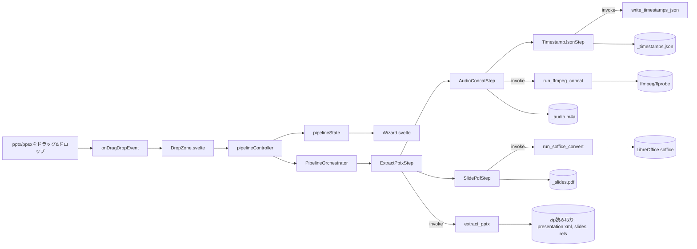

# オンデマンドスライドコンバーター 仕様書 v1
### （Tauri / Bun / TypeScript / SvelteKit 版）

対象読者：このツールを実装するエンジニア（Claude Code含む）

- **ツール名**：オンデマンドスライドコンバーター
- **リポジトリ名**：`ondemandclass_mspp_converter`
- **ホスト先**：https://github.com/rinfromniigata/ondemandclass_mspp_converter

---

## 0. 目的とスコープ

### 背景
一部のオンデマンド授業（例：「創作に係る倫理と知的財産」）は、講師が
PowerPoint（.pptx）のみをClassroomで配布する形式を取る。この pptx は
スライド切り替えタイミングとナレーション音声がすべて内部に埋め込まれた
自己完結型の教材であり、通常のオンライン授業のように画面録画や動画から
音声を取り出す必要がない。しかし、動画ファイルではないため、そのままでは
文字起こし（Comulytic / Whisper）にも一次資料としてのPDF化にも使えない。

### 目的
pptxファイル（またはppsxファイル）1つをアプリにドラッグ＆ドロップするだけで、以下3種の
成果物を**元のファイルと同じディレクトリ**に自動生成する。

- ppsx（PowerPointスライドショー形式）はpptxと同一のOOXML構造（`ppt/presentation.xml`
  以下）を持ち、差異は`[Content_Types].xml`のメインパートContent Typeのみであるため、
  以降の処理はpptxと共通とする。本仕様中の「pptx」は特記なき限りpptx/ppsxの両方を指す。
- `<basename>` は入力ファイル名から拡張子（`.pptx` / `.ppsx`）を除いたもの。

1. `<basename>_audio.m4a` … スライド順に結合されたナレーション音声（結合音声）
2. `<basename>_slides.pdf` … スライド内容をそのまま書き出したテキスト層付きPDF（OCR不要）
3. `<basename>_timestamps.json` … 結合音声内での各スライドの開始・終了時刻対応表

この3点は既存の `archive_workflow.md` における工程1（音声取り出し）・
工程3（スライド取得）の出力形式と互換であり、生成後はそのまま工程2
（文字起こし：Comulytic）・工程4（補正：Gemini Gem、timestampsも併せて
投入）に合流できることを前提とする。

### 非スコープ（重要・変更禁止の設計制約）
- **文字起こし・補正・一次情報収集などの後続工程は本ツールの対象外**とする。
  本ツールの責務は3種の成果物を書き出すところまでで完結させる。
- ネットワーク通信は行わない（LibreOffice・ffmpegともにローカル実行のみ）。
  外部APIへのアップロードや自動連携は一切実装しない。
- 監視フォルダ等による自動実行（フォルダにpptxが追加されたら自動変換
  される、等）は実装しない。**常にユーザーのドラッグ＆ドロップ操作を
  トリガーとする。**
- pptx/ppsx以外の形式（.ppt / .pps / .pptm / .key / Google スライド等）への対応は本仕様の
  対象外とする。将来拡張の余地は残すが、v1では pptx/ppsx 専用とする。
- **動画として埋め込まれたナレーション**（PowerPointの「録画」でカメラを
  オンにした場合等、スライドに動画メディアが含まれるケース）の音声抽出は
  v1の対象外とする。検出した場合は警告を出し、そのスライドは無音スライド
  として扱う（8章）。
- 複数ファイルの一括ドロップ、`archive_workflow.md` 工程7（保存）への
  自動配置は対象外とする（13章）。

---

## 1. 技術スタック

| レイヤ | 技術 | 役割 |
|---|---|---|
| デスクトップシェル | Tauri v2 | Rustバックエンド＋Webviewフロントエンドのハイブリッドアプリ |
| パッケージ管理／スクリプト実行 | Bun | `bun install` / `bun run tauri dev` 等 |
| 言語（フロント） | TypeScript | 型安全なUIロジック |
| UIフレームワーク | SvelteKit（Svelte 5、`@sveltejs/adapter-static`によるSPA構成） | 軽量な状態機械的UI記述 |
| フロントのテスト | Vitest | Orchestrator・純粋関数の単体テスト |
| pptx（zip）読み取り | Rust `zip` crate | ppt/配下のXML・メディアファイルの読み取り |
| XML解析 | Rust `quick-xml` crate | `presentation.xml` / `slideN.xml` / 各`*.rels` の解析 |
| 一時ディレクトリ | Rust `tempfile` crate | Drop時に自動削除される一時ディレクトリ（9章） |
| 音声結合 | ffmpeg（外部プロセス起動） | スライド順に並べた音声のconcat結合 |
| 音声情報取得 | ffprobe（外部プロセス起動） | 各音声パートのコーデック・サンプルレート・チャンネル数・再生時間の取得 |
| PDF変換 | LibreOffice（`soffice --headless`、外部プロセス起動） | pptxからテキスト層付きPDFへの直接変換 |
| ドラッグ＆ドロップ受付 | Tauri v2 標準の `onDragDropEvent` | OS標準のファイルドロップイベント受信。追加ライブラリ不要 |
| プロセス実行（Rust） | `std::process::Command` | ffmpeg / ffprobe / soffice の起動。タイムアウト制御と、Windowsでのコンソール窓非表示（`CREATE_NO_WINDOW`）を行う |
| 確認ダイアログ | `tauri-plugin-dialog` | 上書き確認（8章-6） |
| フォルダを開く | `tauri-plugin-opener` | 出力ファイルをエクスプローラーで表示（7章） |

対象OSはWindowsを主とする（`archive_workflow.md`のツール群と同一環境）。
LibreOffice・ffmpegはユーザー環境に事前インストール済みであることを
前提とし、パスは設定ファイルで指定可能にする（4章参照）。

外部プロセスはRust側から `std::process::Command` で直接起動する。
フロントからプロセスを起動する必要はないため `tauri-plugin-shell` は使用しない
（権限スコープの設定が不要になり、タイムアウト制御も実装しやすいため）。

SvelteKitはTauriのWebview内で静的ファイルとして動作させるため、以下を必須とする。

- `@sveltejs/adapter-static` を使用し、`fallback: "index.html"` を指定する
- ルートの `src/routes/+layout.ts` で `export const ssr = false;` とする
  （Tauri APIはブラウザ環境でのみ動作するため、SSRを無効化する）
- ルーティングは単一ページ（`src/routes/+page.svelte`）のみとし、画面遷移は
  URLではなく `pipelineState.view` で切り替える（7章）

---

## 2. 全体アーキテクチャ



- **zip読み取り・XML解析・外部プロセス（ffmpeg/ffprobe/soffice）起動・
  ファイル書き出しはすべてRust側のTauriコマンドとして実装する**
  （ファイルI/Oとプロセス起動はTauriの権限モデル上もRust側に置くのが自然なため）
- **フロントのSvelteKit/TypeScriptはOrchestratorとStepの制御フローのみを
  持ち、パース処理そのもののロジックは持たない**（Rust側の責務を
  フロントに漏らさない）
- スライド順序解決は `extract_pptx` の内部で行い、`ExtractPptxStep` の
  出力（表示順に並んだ `SlideAudioEntry[]`）として `AudioConcatStep` に渡す。
  独立したステップにはしない
- Rust側は「Tauriコマンド層（薄い入口）」と「ドメイン層（pptx解析・音声計画・
  タイムライン計算などの純粋ロジック）」に分け、ドメイン層はTauriに依存させない
  （単体テストを容易にし、仕様変更の影響範囲を局所化するため）
- ドロップ受付から処理開始・状態遷移までの制御は `pipelineController.ts` に集約し、
  コンポーネントにはロジックを持たせない

---

## 3. ディレクトリ構成

```
ondemandclass_mspp_converter/
├─ src-tauri/
│  ├─ src/
│  │  ├─ main.rs                    # lib::run() を呼ぶだけ
│  │  ├─ lib.rs                     # プラグイン初期化、State登録、コマンド登録
│  │  ├─ commands/                  # Tauriコマンド層（薄い入口）
│  │  │  ├─ mod.rs
│  │  │  ├─ settings.rs             # load_and_validate_settings
│  │  │  ├─ pptx_extract.rs         # extract_pptx
│  │  │  ├─ audio_process.rs        # run_ffmpeg_concat
│  │  │  ├─ pdf_convert.rs          # run_soffice_convert
│  │  │  └─ output_files.rs         # check_outputs_exist, write_timestamps_json
│  │  ├─ settings/                  # 設定ファイルの探索・読み込み・検証
│  │  ├─ pptx/                      # pptx解析（順序解決・rels・p:timing・advTm）
│  │  ├─ audio/                     # ffprobe解析、結合計画、タイムライン計算、ffmpeg実行
│  │  ├─ pdf/                       # soffice実行
│  │  └─ process.rs                 # 外部プロセス実行共通処理（タイムアウト・窓非表示）
│  ├─ capabilities/
│  │  └─ default.json               # 権限定義
│  ├─ Cargo.toml
│  └─ tauri.conf.json
├─ src/
│  ├─ routes/
│  │  ├─ +layout.ts                 # export const ssr = false;（SPA化）
│  │  └─ +page.svelte               # Wizard.svelte を配置するだけの唯一のページ
│  ├─ lib/
│  │  ├─ steps/
│  │  │  ├─ types.ts                # PipelineState, StepResult, SlideAudioMap 等
│  │  │  ├─ extractPptxStep.ts
│  │  │  ├─ audioConcatStep.ts      # buildSegments（純粋関数）を含む
│  │  │  ├─ slidePdfStep.ts
│  │  │  └─ timestampJsonStep.ts
│  │  ├─ components/
│  │  │  ├─ DropZone.svelte         # idle画面。pptx/ppsxのD&D受付、設定エラー表示
│  │  │  ├─ Wizard.svelte           # pipelineState.viewで出し分けるだけ
│  │  │  ├─ ProcessingView.svelte   # 各StepResultを逐次ログ表示
│  │  │  └─ ResultView.svelte       # 生成物のパス表示・フォルダを開くボタン
│  │  ├─ tauriCommands.ts           # Rustコマンドの型付きinvokeラッパー
│  │  ├─ outputPaths.ts             # 入力パスから出力3ファイルのパスを決定（13章）
│  │  ├─ orchestrator.ts            # PipelineOrchestrator
│  │  ├─ pipelineController.ts      # ドロップ後の受付判定・上書き確認・状態遷移
│  │  ├─ pipelineStore.ts           # writable<PipelineState>
│  │  └─ settings.ts                # 設定の読み込み・検証結果ストア（4.2）
│  └─ app.html
├─ svelte.config.js                  # adapter-static（fallback: "index.html"）
├─ vite.config.ts
├─ app.settings.json                 # 実環境の設定（.gitignore対象。コミットしない）
├─ app.settings.example.json         # 設定のひな形（コミットする）
├─ package.json
└─ bun.lock
```

---

## 4. データモデル

### 4.1 TypeScript型定義（`src/lib/steps/types.ts`）

```typescript
export interface SlideAudioEntry {
  slideIndex: number;          // 1始まり、表示順
  slideXmlPath: string;        // 例: "ppt/slides/slide3.xml"
  audioMediaPaths: string[];   // 例: ["ppt/media/media2.m4a"]（同一スライド内の複数音声は再生順で格納。リンク切れは含めない）
  hasAudio: boolean;           // audioMediaPaths が1件以上なら true
  linkBroken: boolean;         // 外部リンク参照・実体なしの音声が1件以上あれば true
  advanceSec: number | null;   // p:transition の advTm（自動切り替え時間、秒）。未設定なら null
}

export interface SlideAudioMap {
  slides: SlideAudioEntry[];   // 表示順
  warnings: string[];          // リンク切れ・動画ナレーション検出等（スライド番号を含む文言）
}

// 結合音声を構成する区間。スライドの表示順に並ぶ
export type AudioSegment =
  | { slideIndex: number; kind: "media"; mediaPath: string }     // pptx内のメディアパス
  | { slideIndex: number; kind: "silence"; durationSec: number };

export interface SlideTimestampEntry {
  slide: number;       // slideIndex
  startSec: number;    // 結合音声内での開始秒
  endSec: number;      // 結合音声内での終了秒（skip時の無音スライドは startSec と同値）
}

export interface OutputPaths {
  dir: string;         // 入力ファイルのディレクトリ
  basename: string;    // 拡張子を除いた入力ファイル名
  audio: string;       // <dir>/<basename>_audio.m4a
  pdf: string;         // <dir>/<basename>_slides.pdf
  json: string;        // <dir>/<basename>_timestamps.json
}

export interface StepResult {
  stepName: string;
  success: boolean;
  message: string;
  warnings?: string[]; // 成功扱いだが利用者に知らせるべき事項（リンク切れ等）
  outputPath?: string;
}

export interface ActionStep<TInput, TOutput> {
  readonly name: string;
  execute(input: TInput): Promise<StepResult & { data?: TOutput }>;
}

// パイプライン全体の状態。Wizard.svelte はこれだけを見て表示を切り替える
export type PipelineState =
  | { view: "idle"; notice?: string }  // notice: 直前の受付拒否理由（拡張子不正・複数ファイル等）
  | { view: "processing"; inputPath: string; results: StepResult[] }
  | { view: "done"; inputPath: string; results: StepResult[]; outputs: { audio: string; pdf: string; json: string } }
  | { view: "error"; inputPath: string; results: StepResult[]; outputs: Partial<{ audio: string; pdf: string; json: string }>; failedSteps: string[] };
```

- 3ステップ（音声・PDF・JSON）がすべて成功した場合のみ `done`。
  1つでも失敗した場合は `error` とし、生成できた成果物は `outputs` に保持する。

### 4.2 `app.settings.json`

```json
{
  "ffmpegPath": "C:\\ffmpeg\\bin\\ffmpeg.exe",
  "ffprobePath": "C:\\ffmpeg\\bin\\ffprobe.exe",
  "sofficePath": "C:\\Program Files\\LibreOffice\\program\\soffice.exe",
  "silentSlideHandling": "insert_silence",
  "silentSlideDefaultSec": 3,
  "audioReencodeOnMismatch": true
}
```

- `silentSlideHandling`：`"insert_silence"`（無音区間を挿入してtimestamp精度を優先）
  または `"skip"`（無音スライドを結合音声から詰めて省略）のいずれか。
  デフォルトは `"insert_silence"`。
- `silentSlideDefaultSec`：`insert_silence` 時、無音スライドに自動切り替え時間
  （`advTm`）が設定されていない場合に挿入する無音の秒数。0以上の数値。デフォルト `3`。
- `audioReencodeOnMismatch`：音声パート間でコーデック／サンプルレート／チャンネル数が
  不一致の場合に、再エンコード結合へ自動的に切り替えるかどうか（8章参照）。
  デフォルト `true`。`false` で不一致の場合は音声結合を失敗として扱う。
- 省略可能な項目（`silentSlideHandling` / `silentSlideDefaultSec` /
  `audioReencodeOnMismatch`）は省略時にデフォルト値を用いる。3つの実行パスは必須。

#### 配置場所
- 開発時（debugビルド、`bun run tauri dev`）：リポジトリ直下の `app.settings.json`
- 配布ビルド（releaseビルド）：実行ファイル（.exe）と同じフォルダの `app.settings.json`
- どちらの場合も、ファイルがない場合は idle 画面で「`app.settings.json` が見つかりません
  （探したパス）。`app.settings.example.json` をコピーして作成してください」と表示する。

---

## 5. Rust側（src-tauri）コマンド仕様

すべてのコマンドは `async` とし、重い処理は `tauri::async_runtime::spawn_blocking`
上で実行する（音声結合とPDF変換を実際に並行動作させるため）。
Rust側の構造体はフロントの型と一致させるため `#[serde(rename_all = "camelCase")]` とする。

### `load_and_validate_settings() -> SettingsStatus`
- 責務：4.2の配置場所から設定ファイルを読み込み、以下を検証する。
  検証に通った設定はTauriの `State` に保持し、他のコマンドはそこから実行パスを参照する。
  - ファイルが存在し、JSONとして解釈できること
  - `ffmpegPath` / `ffprobePath` / `sofficePath` が実在するファイルであること
  - `silentSlideHandling` が既定値のいずれかであり、`silentSlideDefaultSec` が0以上であること
- 出力：`{ ok: boolean, settingsPath: string, settings: AppSettings | null, errors: string[] }`
  - エラー文言は項目名を含める（例：「設定ファイルの ffmpegPath を確認してください（C:\ffmpeg\bin\ffmpeg.exe が見つかりません）」）
- アプリ起動時と、idle画面の「設定を再読み込み」ボタン押下時に呼ばれる

### `extract_pptx(input_path: String) -> Result<SlideAudioMap, String>`
- 責務（zipをディスクに展開せず、メモリ上で読み取る）：
  1. `ppt/presentation.xml` の `p:sldIdLst` を上から読み、各 `r:id` を
     `ppt/_rels/presentation.xml.rels` で `ppt/slides/slideN.xml` に変換し、
     **表示順のスライドリスト**を確定する
  2. 各 `slideN.xml` について `ppt/slides/_rels/slideN.xml.rels` を参照し、
     音声図形（`a:audioFile` の `r:link` が指すRelationship）を解決する
  3. 同一スライド内に複数の音声パートがある場合、`slideN.xml` 内の
     `p:timing` における `p:audio` ノードの出現順（その `p:spTgt spid` が指す図形）に従って
     `audioMediaPaths` を並べる。rels ファイル内の記載順を鵜呑みにしない。
     `p:timing` から参照されない音声図形は、図形ツリー内の出現順で末尾に追加する
  4. 音声が存在しないスライドは `hasAudio: false` として記録する
  5. 音声のRelationshipが **外部リンク参照**（`TargetMode="External"`）であるか、
     参照先が zip 内に実在しない場合は、その音声を `audioMediaPaths` に含めず
     `linkBroken: true` とし、「スライドN：音声がリンク切れのため無音として扱います」を
     `warnings` に追加する。**エラーにはしない**（`r:link` 属性の有無では判定しない。
     埋め込み音声も通常 `r:link` で参照されるため）
  6. `p:transition` の `advTm` 属性（ミリ秒）を秒に換算して `advanceSec` に格納する
  7. 動画メディア（`a:videoFile`）を検出した場合は「スライドN：動画ナレーションは
     v1では対象外のため無音として扱います」を `warnings` に追加する
- 出力：`SlideAudioMap`
- エラー：zipとして開けない、`presentation.xml` が存在しない、
  スライド順序が解決できない場合に `Err(String)`

### `run_ffmpeg_concat(input_path: String, slide_indices: Vec<u32>, segments: Vec<AudioSegment>, out_path: String, reencode_on_mismatch: bool) -> Result<ConcatResult, String>`
- 責務：
  1. `tempfile::TempDir` を作成し、`segments` 中の `media` 区間の音声を
     入力pptxから一時ディレクトリへ取り出す（コマンド終了時にDropで自動削除）
  2. ffprobeで各音声のコーデック・サンプルレート・チャンネル数・再生時間を取得する
  3. **結合方式を事前判定する**：全音声がAACで、サンプルレートとチャンネル数が
     一致する場合は copy 方式、それ以外は再エンコード方式とする。
     再エンコード方式が必要で `reencode_on_mismatch = false` の場合は `Err`
  4. `silence` 区間は `ffmpeg -f lavfi -i anullsrc` で生成する。
     copy 方式では音声と同じコーデック・サンプルレート・チャンネル数で生成する
  5. copy 方式：concat demuxer＋`-c copy` で結合する。ffmpegが非ゼロ終了した場合、
     `reencode_on_mismatch = true` なら再エンコード方式で再試行する
  6. 再エンコード方式：各区間をいったん `pcm_s16le / 48kHz / 最大チャンネル数` の
     WAVに正規化してから、concat demuxer＋`-c:a aac -b:a 192k` で結合する
  7. 各区間の再生時間を累積し、`slide_indices` の全スライドについて
     `SlideTimestampEntry` を計算する。区間を持たないスライド（skip時の無音スライド）は
     その時点の累積値で `startSec = endSec` とする
  8. 出力は `-movflags +faststart` を付けて `out_path` に書き出す
- 出力：`{ timestamps: SlideTimestampEntry[], reencoded: boolean }`
- エラー：ffmpeg/ffprobeが起動できない、結合処理が再エンコードでも失敗する、
  タイムアウト（1プロセスあたり300秒）の場合に `Err(String)`

### `run_soffice_convert(input_path: String, out_path: String) -> Result<String, String>`
- 責務：
  1. `tempfile::TempDir` を出力先として
     `soffice -env:UserInstallation=<アプリ専用プロファイル> --headless --convert-to pdf --outdir <一時dir> <input_path>`
     を実行する。アプリ専用プロファイルはアプリのローカルデータフォルダ配下に置き、
     起動をまたいで再利用する（ユーザーが起動中のLibreOfficeとの衝突を避け、
     2回目以降の起動を速くするため）
  2. 一時フォルダに生成された `<basename>.pdf` を `out_path`（`<basename>_slides.pdf`）へ移動する
     （元フォルダの同名 `<basename>.pdf` を上書きしないため。ドライブをまたぐ場合はコピー＋削除）
  3. タイムアウトは120秒とし、超過時はプロセスを終了して `Err`
- 出力：生成されたPDFのフルパス
- 備考：LibreOfficeは埋め込み音声を無視して純粋にスライドの視覚内容
  （テキスト・図形・画像）のみをPDF化するため、OCR工程は不要
- エラー：sofficeが起動できない、非ゼロ終了、PDFが生成されない、タイムアウトの場合に `Err(String)`

### `check_outputs_exist(paths: Vec<String>) -> Vec<String>`
- 責務：渡されたパスのうち既に存在するものを返す（上書き確認用）

### `write_timestamps_json(out_path: String, entries: Vec<SlideTimestampEntry>) -> Result<String, String>`
- 責務：`entries` を6章のスキーマで整形（秒は小数点以下3桁に丸める）し、
  UTF-8で `out_path` に書き出す。書き出したパスを返す

---

## 6. TypeScript側 モジュール仕様

各Stepは `tauriCommands.ts` 経由でのみRustを呼び出し、例外を投げず必ず
`StepResult` を返す（invokeの例外は捕捉して `success: false` に変換する）。

### `src/lib/steps/extractPptxStep.ts`
- Rustの `extract_pptx` を呼び出すだけの薄いラッパー
- `SlideAudioMap.warnings` を `StepResult.warnings` に載せる
- 戻り値の `SlideAudioMap` を `AudioConcatStep` の入力として
  `PipelineOrchestrator` 経由で受け渡す

### `src/lib/steps/audioConcatStep.ts`
- コンストラクタで設定値（`silentSlideHandling` / `silentSlideDefaultSec` /
  `audioReencodeOnMismatch`）を受け取る
- 純粋関数 `buildSegments(slides, settings): AudioSegment[]` で区間列を組み立てる
  - 音声ありスライド：`audioMediaPaths` の順に `media` 区間
  - 無音スライド（リンク切れ含む）：`insert_silence` なら
    `advanceSec ?? silentSlideDefaultSec` 秒の `silence` 区間（0秒なら区間を作らない）、
    `skip` なら区間を作らない
- **音声を持つスライドが1枚もない場合**は `run_ffmpeg_concat` を呼ばずに
  `success: false`（「音声を含むスライドがありません」）を返す
- `run_ffmpeg_concat` を呼び、`timestamps` を `TimestampJsonStep` に渡すデータとして返す。
  再エンコードした場合はその旨を `warnings` に載せる
- 出力ファイルは `OutputPaths.audio`

### `src/lib/steps/slidePdfStep.ts`
- `run_soffice_convert` を呼び出すだけ。出力ファイルは `OutputPaths.pdf`
- `AudioConcatStep` の結果を待たずに**並行実行可能**（互いに依存しない）。
  `PipelineOrchestrator` はこの2ステップを並列実行する

### `src/lib/steps/timestampJsonStep.ts`
- `AudioConcatStep` が計算した `SlideTimestampEntry[]` を
  `write_timestamps_json` で `OutputPaths.json` に書き出す
- スキーマ（全スライドを表示順に1件ずつ含む）：

```json
[
  { "slide": 1, "startSec": 0.0, "endSec": 42.3 },
  { "slide": 2, "startSec": 42.3, "endSec": 88.1 }
]
```

### `src/lib/outputPaths.ts`
- 純粋関数 `resolveOutputPaths(inputPath: string): OutputPaths`
- 出力先の決定ロジックをここに集約する（v1は入力と同じディレクトリ固定。13章）

### `src/lib/orchestrator.ts`
```typescript
export class PipelineOrchestrator {
  // 各Stepはコンストラクタで注入する（テスト時にモックへ差し替えるため）
  constructor(private readonly steps: {
    extract: ActionStep<{ inputPath: string }, SlideAudioMap>;
    audio: ActionStep<{ inputPath: string; slideAudioMap: SlideAudioMap; outPath: string }, { timestamps: SlideTimestampEntry[] }>;
    pdf: ActionStep<{ inputPath: string; outPath: string }, string>;
    json: ActionStep<{ timestamps: SlideTimestampEntry[]; outPath: string }, string>;
  }) {}

  async run(inputPath: string, outputs: OutputPaths, onProgress: (r: StepResult) => void): Promise<RunSummary> {
    const extractResult = await this.steps.extract.execute({ inputPath });
    onProgress(extractResult);
    if (!extractResult.success) return { outputs: {}, failedSteps: [extractResult.stepName] }; // 順序解決が前提のため以降は実行しない

    // 並列実行し、到着順に onProgress へ通知する
    const audioPromise = this.steps.audio.execute({ inputPath, slideAudioMap: extractResult.data!, outPath: outputs.audio })
      .then((r) => { onProgress(r); return r; });
    const pdfPromise = this.steps.pdf.execute({ inputPath, outPath: outputs.pdf })
      .then((r) => { onProgress(r); return r; });
    const [audioResult, pdfResult] = await Promise.all([audioPromise, pdfPromise]);

    // audio 成功時のみ JSON を書き出す。成果物・失敗ステップを集計して RunSummary を返す
    // …
  }
}

export interface RunSummary {
  outputs: Partial<{ audio: string; pdf: string; json: string }>;
  failedSteps: string[];
}
```
- `ExtractPptxStep` の失敗のみ後続を止める「必須先行ステップ」として扱う。
  それ以外（音声結合とPDF変換）は独立ステップとして、片方が失敗しても
  もう片方の結果は成果物として残す（8章の設計制約）
- 音声結合が失敗した場合、`TimestampJsonStep` は実行せず失敗扱いとする

### `src/lib/pipelineController.ts`
- `startConversion(paths: string[])`：DropZoneから呼ばれる唯一の入口
  1. 設定が検証済みでなければ受け付けない
  2. ファイルが1つでない、または拡張子が `.pptx` / `.ppsx` でない場合は
     `{ view: "idle", notice }` にして終了
  3. `resolveOutputPaths` で出力パスを決め、`check_outputs_exist` で既存ファイルを確認する。
     1つでもあれば確認ダイアログ（既存ファイル名を列挙）を出し、キャンセルなら idle に戻す
  4. `{ view: "processing", inputPath, results: [] }` にし、`PipelineOrchestrator.run()` を実行する。
     `onProgress` で `results` に追記する
  5. `RunSummary` から `done` / `error` へ遷移する
- 処理中（`processing`）のドロップは無視する

### `src/lib/pipelineStore.ts`
```typescript
import { writable } from "svelte/store";
import type { PipelineState } from "./steps/types";

export const pipelineState = writable<PipelineState>({ view: "idle" });
```

### `src/lib/settings.ts`
- `settingsStatus` ストア（`SettingsStatus | null`）と `reloadSettings()` を提供する
- アプリ起動時（`+page.svelte` のマウント時）に1回 `reloadSettings()` を呼ぶ

---

## 7. Svelteコンポーネント仕様

### `DropZone.svelte`
- `$pipelineState.view === "idle"` のときのみ表示
- Tauri v2 標準の `onDragDropEvent` をリッスンし、ドロップされたパスを
  `startConversion()` に渡す（拡張子判定等は `pipelineController` が行う）。
  ドラッグ中（enter/over）はドロップ可能であることを視覚的に示す
- マウント時にリスナーを登録し、アンマウント時に解除する
- `settingsStatus.ok === false` の場合は設定エラー一覧と設定ファイルのパスを表示し、
  ドロップを受け付けない。「設定を再読み込み」ボタンで `reloadSettings()` を呼ぶ
- `notice`（拡張子不正・複数ファイル等の受付拒否理由）があれば表示する

### `Wizard.svelte`
- `$pipelineState.view` に応じて `DropZone` / `ProcessingView` / `ResultView`
  を出し分けるだけ（ロジックを持たない）。`done` と `error` はどちらも `ResultView`

### `ProcessingView.svelte`
- `results` を逐次ログとして表示（成功=緑、警告付き成功=黄、失敗=赤）
- `AudioConcatStep` と `SlidePdfStep` は並行実行されるため、到着順に
  ログへ積む（順序は固定しない）

### `ResultView.svelte`
- 生成されたファイルのフルパスを表示（`error` 時は生成できたものだけ）
- 各ステップの警告（リンク切れ・動画ナレーション・再エンコード等）を一覧表示する
- 「出力フォルダを開く」ボタン（生成されたファイルの1つをエクスプローラーで選択表示する）
- 「別のファイルを変換する」ボタンで `{ view: "idle" }` に戻す
- `view === "error"` の場合は、`results` の中から `success: false` の
  ステップのメッセージを強調表示し、原因（例：音声なし、
  ffmpegの失敗内容）をそのまま提示する

---

## 8. 設計上の注意点・エッジケース（実装時必読）

これらは前段の検討で洗い出された既知の落とし穴であり、実装時に
必ず考慮すること。

1. **スライド順序はrelsの記載順ではなくpresentation.xmlのsldIdLst順**
   で確定する。`ppt/slides/`配下のファイル名の数字（slide1.xml,
   slide2.xml…）は編集履歴に依存するため表示順と一致しない前提で
   実装する。
2. **1スライド内の複数音声パート**（質疑応答的に区切って録音された
   ケース等）は `slideN.xml` 内の `p:timing` の再生順で結合順を
   決定する。rels側の並びを信用しない。
3. **音声コーデック／サンプルレート／チャンネル数の不一致**：ffmpegの
   `-c copy` 結合は不一致でも異常終了せず壊れた音声を出力することがあるため、
   失敗を待たず**ffprobeで事前に判定**して再エンコード結合
   （`-c:a aac -b:a 192k`）に切り替える。事前判定で一致していても
   copy 結合が失敗した場合は再エンコードで再試行する
   （いずれも `app.settings.json` の `audioReencodeOnMismatch` で制御）。
4. **無音スライドの扱い**：`silentSlideHandling` 設定に従い、
   「無音区間を挿入してtimestamp精度を保つ」か「詰めて省略する」かを
   ユーザー設定で切り替え可能にする。デフォルトは前者。挿入する無音の長さは
   スライドの自動切り替え時間（`advTm`）、未設定なら `silentSlideDefaultSec`。
   省略時もJSONには長さ0の区間として出力し、スライド番号を連続させる。
5. **音声が外部リンク参照の場合**：Relationshipが `TargetMode="External"` の場合、
   または参照先が zip 内に実在しない場合はリンク切れとみなす
   （`r:link` 属性は埋め込み音声でも使われるため判定に使わない）。
   そのスライドは無音スライドとして扱い、`ExtractPptxStep` の警告に
   リンク切れの旨と該当スライド番号を明記する。パイプライン全体は停止させない。
6. **同名ファイルの上書き確認**：出力先に同名の
   `<basename>_audio.m4a` 等が既に存在する場合、無条件上書きせず
   **処理開始前（ドロップ直後）**に確認ダイアログを挟む（誤操作による過去成果物の
   消失を防ぐため）。キャンセル時は何も書き出さず idle に戻る。
7. **音声を含まないpptx**：音声結合とJSON書き出しは失敗扱いとし理由を表示する。
   PDFは生成する。
8. **sofficeの出力名**：sofficeは入力と同名の `<basename>.pdf` を出力するため、
   必ず一時フォルダに出力してから `<basename>_slides.pdf` へ移動する。
9. **動画ナレーション**：スライドに動画メディアが含まれる場合は警告を出し、
   無音スライドとして扱う（v1スコープ外）。

---

## 9. 非機能要件

- 一時ディレクトリ（音声取り出し先・PDF出力先）は処理完了後（成功・失敗いずれの
  場合も）に必ず削除する。`tempfile::TempDir` のDropで後始末し、
  コマンドをまたいで一時ディレクトリを保持しない。
  pptx解析（`extract_pptx`）はディスクに展開せずメモリ上で行う。
- LibreOffice（soffice）は初回起動が遅い（プロファイル初期化）ため、
  変換処理には120秒のタイムアウトを設ける。ffmpeg/ffprobe は1プロセスあたり300秒。
- 外部プロセスの起動時はコンソール窓を表示しない（Windows `CREATE_NO_WINDOW`）。
  標準出力・標準エラーは別スレッドで読み取り、パイプ詰まりによる停止を防ぐ。
- ffmpeg/ffprobe/soffice の実行ファイルが `app.settings.json` のパスに
  存在しない場合、処理開始前にバリデーションし、分かりやすいエラー
  メッセージ（「設定ファイルのffmpegPathを確認してください」等）を
  `idle` 画面の時点で表示する。

---

## 10. SOLID原則の適用方針

| 原則 | 適用箇所 |
|---|---|
| 単一責任 (SRP) | 各Stepクラスは1つの変換処理しか担当しない。`ExtractPptxStep`はパース、`AudioConcatStep`は結合、`SlidePdfStep`は変換、`TimestampJsonStep`は書き出しのみ。Rust側もコマンド層とドメイン層（`pptx/` / `audio/` / `pdf/` / `settings/`）で責務を分離 |
| 開放閉鎖 (OCP) | 無音スライドの扱い（挿入/省略）やコーデック不一致時の挙動は `app.settings.json` の設定値で切り替わり、Stepクラス自体のコード変更を要しない |
| リスコフの置換 (LSP) | すべてのStepは `ActionStep<TInput, TOutput>` の契約（例外を投げず必ず `StepResult` を返す）を守る |
| インターフェース分離 (ISP) | `ActionStep` は `name` と `execute` のみの最小インターフェース |
| 依存性逆転 (DIP) | `Wizard.svelte` は `pipelineState` という抽象状態にのみ依存する。`PipelineOrchestrator` は注入された `ActionStep` の共通インターフェースにのみ依存し、実装詳細（zip解析かffmpeg呼び出しか）を意識しない |

---

## 11. 開発・ビルド手順

```bash
# 初回セットアップ（既存リポジトリへの導入。詳細はimple参照）
# 一時フォルダで bun create tauri-app --template svelte-ts を実行し、生成物をリポジトリ直下へ取り込む
bun install
cargo add zip quick-xml tempfile serde serde_json tauri-plugin-dialog tauri-plugin-opener --manifest-path src-tauri/Cargo.toml
bun add @tauri-apps/plugin-dialog @tauri-apps/plugin-opener
bun add -d vitest

# 設定ファイルの作成
cp app.settings.example.json app.settings.json   # 自環境のパスに書き換える

# 開発起動（事前にffmpeg・LibreOfficeがローカルにインストール済みであること）
bun run tauri dev

# テスト
cargo test --manifest-path src-tauri/Cargo.toml
bun run test

# ビルド（生成された .exe と同じフォルダに app.settings.json を置く）
bun run tauri build
```

---

## 12. 受け入れ基準（Acceptance Criteria）

- [ ] アプリ起動直後はドロップゾーンのみが表示される（idle画面）
- [ ] pptxファイルまたはppsxファイルをドロップすると自動的に処理が開始し、
      `ExtractPptxStep` → （`AudioConcatStep` と `SlidePdfStep` を並行実行）
      → `TimestampJsonStep` の順でログが表示される
- [ ] 生成される3ファイルが元ファイルと同じディレクトリに
      `<basename>_audio.m4a` / `<basename>_slides.pdf` /
      `<basename>_timestamps.json` として書き出される
- [ ] スライド順序が `presentation.xml` の `sldIdLst` に基づいて
      正しく解決され、`ppt/slides/slideN.xml` のファイル名の数字順とは
      無関係に表示順が確定していることをテストで確認できる
- [ ] 1スライド内に複数音声パートがある場合、`p:timing` の再生順で
      結合されることをテストで確認できる
- [ ] 音声のコーデック／サンプルレート／チャンネル数が不一致の場合、
      自動で再エンコード結合に切り替わり、正常な音声が生成される
- [ ] 無音スライドが含まれる場合、`silentSlideHandling` 設定に応じて
      無音区間挿入／詰めて省略のいずれかが選択どおりに行われる
- [ ] 音声が外部リンク参照でリンク切れのスライドがあっても、
      パイプライン全体は停止せず、該当スライド番号を含む警告
      メッセージとともに3つの成果物が生成される
- [ ] 音声を含まないpptxでは、音声・JSONが失敗として理由が表示され、PDFは生成される
- [ ] 出力先に同名ファイルが既に存在する場合、処理開始前に
      確認ダイアログが表示され、キャンセルすると何も書き出されない
- [ ] 入力と同じフォルダに `<basename>.pdf` が既にあっても上書きされない
- [ ] ffmpeg・ffprobe・soffice が `app.settings.json` の指定パスに存在しない
      場合、処理開始前にidle画面でエラーが表示され、処理は開始されない
- [ ] 処理完了後、一時ディレクトリが残存していない
      （成功時・失敗時いずれのケースもファイルシステムで確認）
- [ ] フォルダ監視やスケジューラによる自動実行機能が存在しない
      （ドラッグ＆ドロップ以外のトリガーが実装されていないことを
      コードレビューで確認）

---

## 13. 将来拡張ポイント

- `.ppt`（旧形式）や Keynote（`.key`）への対応：`extract_pptx` 相当の
  パーサーをフォーマットごとに追加し、`ActionStep` のインターフェースは
  変更しない
- 動画ナレーションからの音声抽出：`extract_pptx` で動画メディアを区間として返し、
  `run_ffmpeg_concat` で音声トラックを取り出す形で追加できる
- 複数pptxの一括ドロップ（バッチ処理）：`PipelineOrchestrator` を
  ファイルごとに複数生成しキューイングするだけで対応可能な設計に
  しておく（v1ではスコープ外、UIは1ファイルずつの処理を前提とする）
- `archive_workflow.md` の工程7（保存）との連携：生成した3ファイルを
  `/Archive/科目名/日付_回次_タイトル/` 構造へ自動配置するオプションを
  将来追加できるよう、出力パス決定ロジックは `outputPaths.ts` に切り出してある
  （v1では元ファイルと同ディレクトリ固定）

---

## 14. 注意事項・引き継ぎ事項

- `app.settings.json` にはローカル環境固有の実行ファイルパスが
  含まれるため、リポジトリでは `.gitignore` に追加し、
  `app.settings.example.json`（ダミー値）のみをコミットする
- 実際に配布されたpptx/ppsx（著作物）はリポジトリ直下の `samples/` に置き、
  `.gitignore` で除外する。単体テストの入力はテストコード内で生成する
- 本ツールは配布されたpptx単体からの成果物生成に特化しており、
  0章の非スコープに反する機能（自動監視・外部アップロード等）を
  後から追加しないこと
- LibreOfficeのバージョンによって `--convert-to pdf` のレンダリング
  結果（フォント埋め込み・図形の表示崩れ）が変わることがあるため、
  実際に配布されるpptxのフォント・図形要素を用いた動作確認を
  実装後に必ず行うこと
- ppsxはLibreOfficeでは「自動再生」用のインポートフィルタで開かれるため、
  `--headless --convert-to pdf` がpptxと同様にPDFを出力することを、
  実装初期に実ファイルで確認すること（出力されない場合は入力フィルタを
  明示指定する等で対処する）
- copy 方式のAAC結合では、各パートの先頭無音（プライミング）により
  timestampに数十ミリ秒程度のずれが累積しうる。文字起こしとの対応付けには
  影響しない範囲として許容する
- 未決定（実装に影響しないため後回し）：アイコン、インストーラー設定、UIの詳細な配色
